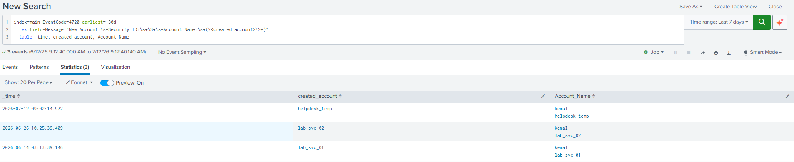

# Detection: Local Account Creation — De-hardcoding a brittle rule

**MITRE ATT&CK:** T1136.001 — Create Account: Local Account
**Data source:** Windows Security event log (Event ID 4720)
**Status:** Extraction generalised and validated. Correlation across the account-lifecycle chain in progress.

---

## The problem

My original detection for local account creation matched on a hardcoded account name from my own testing. It reported a perfect catch rate — because it was matching the one account name I'd typed into the rule, not the *behaviour* of an account being created.

A detection that only matches your simulation isn't a detection. It's a memory of your simulation. If an attacker creates an account with any name I didn't anticipate, the rule is blind.

## The telemetry

A 4720 ("A user account was created") names **two** accounts, and this is the crux of the fix:

```
Subject:      Account Name: kemal          <- the account that DID the creating (actor)
New Account:  Account Name: helpdesk_temp  <- the account that WAS created (target)
```

Splunk's default field extraction pulls "Account Name" from **both** locations into a single `Account_Name` field, so that field holds two values per event and cannot reliably tell you which account was created. Binding a detection to it is unsafe.

The rule must bind to the **New Account** name only — the created account — and ignore Subject, which merely reflects whoever was logged in.

## Before

The 4720 stage of my attack-chain detection filtered on the test account name as a bare keyword. It matched exactly one known account and was deaf to any other.

```spl
index=main sourcetype="WinEventLog:Security" EventCode=4720 lab_svc_02
```

The same hardcoded name appeared in the 4732 (add-to-admins) and 4624 (RDP logon) stages of that detection — four places in total, all keyed to one account name rather than the behaviour.

## After

Extract the created account specifically from the "New Account" block of the raw message, using that phrase as a unique anchor so the creator account can never be captured by mistake.

```spl
index=main EventCode=4720
| rex field=Message "New Account:\s+Security ID:\s+\S+\s+Account Name:\s+(?<created_account>\S+)"
| table _time, created_account, Account_Name
```

No account names appear in the logic. The rule is bound to the *structure* of the event, not to any data value.

## Validation

Run over a 30-day window against all account-creation activity in the lab:



| Time             | created_account (clean) | Account_Name (contaminated) |
|------------------|-------------------------|-----------------------------|
| 2026-07-12 09:02 | helpdesk_temp           | kemal, helpdesk_temp        |
| 2026-06-26 10:25 | lab_svc_02              | kemal, lab_svc_02           |
| 2026-06-14 03:13 | lab_svc_01              | kemal, lab_svc_01           |

Three account creations, three different names, weeks apart. The extraction correctly isolated the created account in every case with zero false field-grabs — proving the logic is bound to the technique, not to any specific name.

**Field-extraction accuracy: 3/3. Hardcoded values: 0.**

## Lesson

The value wasn't building the detection — it was noticing it only worked by accident, and rebuilding it to catch the technique's structure instead of my test data. Validate against the technique's variations, not the one command you ran.

## Next

This generalised extraction is the foundation for the full detection: correlate the created account across its lifecycle — created (4720), added to Administrators (4732), then used to log on over RDP (4624) — all bound to the same `created_account` value within a time window.
