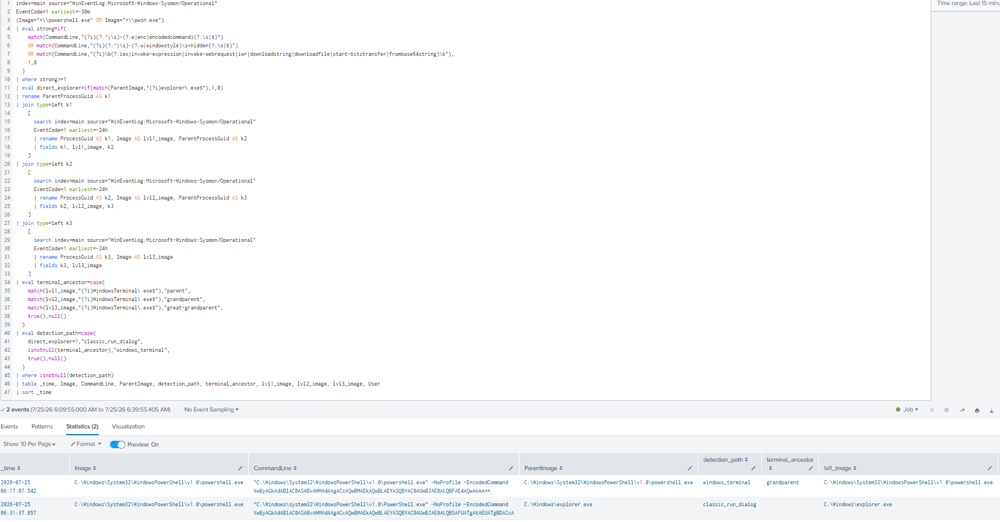
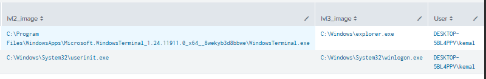
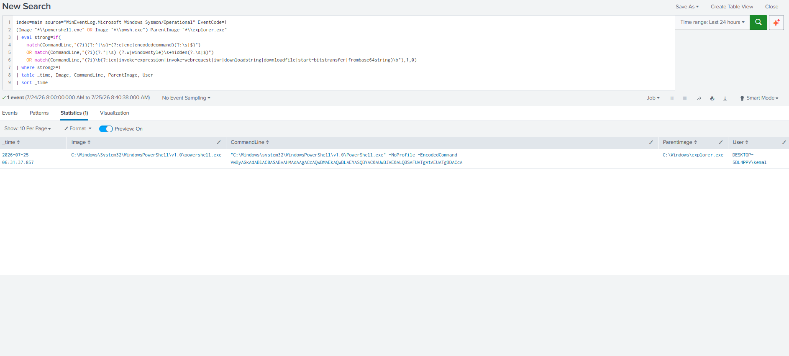
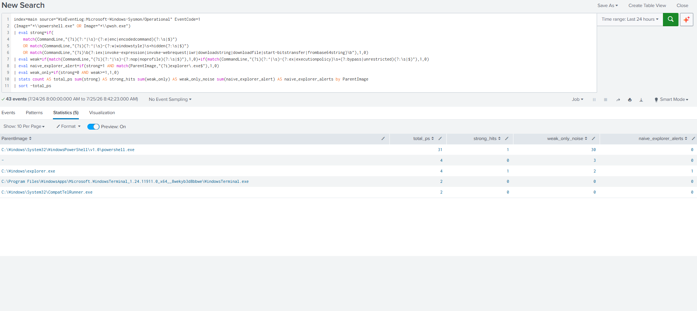

# Detection: ClickFix PowerShell (Run Dialog + Windows Terminal Variant)

## MITRE ATT&CK Mapping
- T1204.004 – User Execution: Malicious Copy and Paste
- T1059.001 – Command and Scripting Interpreter: PowerShell

---

## Description
This detection identifies the PowerShell execution stage of a **ClickFix / fake-CAPTCHA** chain, where a user is socially engineered into pasting a command into the Windows **Run dialog** or a terminal and running it themselves.

It is modelled on the delivery behaviour publicly reported for **Lumma Stealer** ClickFix campaigns, including the **Windows Terminal delivery variant disclosed by Microsoft Threat Intelligence in March 2026**, which was created specifically to defeat detections tuned only for the Run-dialog (`explorer.exe`) parent.

The detection was validated with harmless proxy commands that reproduce the real process lineage. No malware was run, and the adversary attribution refers to publicly documented TTPs — not analysis of a live sample.

---

## Lab Environment
- Kali Linux (Attacker) — not required for this detection
- Windows 10 with Sysmon (Endpoint)
- Ubuntu Server with Splunk Enterprise + Splunk Add-on for Sysmon (SIEM)
- Windows Terminal 1.24 installed on the endpoint (for the Terminal variant)

---

## The coverage gap this solves
A naive rule keys on PowerShell whose immediate parent is `explorer.exe`. The observed lineage of the Windows Terminal variant is:

```
explorer.exe
  └─ WindowsTerminal.exe
       ├─ OpenConsole.exe        (ConPTY sibling — NOT in the shell's parent chain)
       └─ powershell.exe         (the Terminal tab shell)
            └─ powershell.exe     (the pasted command)
```

The malicious PowerShell's **immediate parent is `powershell.exe`**, not `explorer.exe` — so a parent-only rule structurally misses it. `WindowsTerminal.exe` sits at the **grandparent** level and is only reachable by walking the process tree via `ProcessGuid → ParentProcessGuid`.

---

## Attack Simulation
Two harmless variants were generated, both carrying the same strong signal (`-EncodedCommand`) so that the **only** difference is the process lineage.

**Classic Run-dialog variant** (`Win+R`):
```powershell
powershell.exe -NoProfile -EncodedCommand VwByAGkAdABlAC0ASABvAHMAdAAgACcAQwBMAEkAQwBLAEYASQBYAC0AUwBJAE0ALQBSAFUATgAtAEUATgBDACcA
```

**Windows Terminal variant** (run inside Windows Terminal):
```powershell
$b = [Convert]::ToBase64String([Text.Encoding]::Unicode.GetBytes("Write-Host 'CLICKFIX-SIM-ENC'"))
powershell.exe -NoProfile -EncodedCommand $b
```

Both payloads only print a marker string and exit. The value is purely in the lineage they create.

---

## Data Source
**Sysmon (Microsoft-Windows-Sysmon/Operational)**
- Event ID 1 – Process Creation (with `ProcessGuid` / `ParentProcessGuid` for the ancestry walk)

> Requires the **Splunk Add-on for Sysmon** field extraction. Fields (`Image`, `ParentImage`, `CommandLine`, `EventCode`) are extracted natively rather than via `rex`.

---

## Detection Logic
Alert when a PowerShell/pwsh process carries a **strong** command-line signal **and** its lineage matches **either** delivery path:

```
strong_signal
AND ( immediate parent is explorer.exe          # classic Run-dialog variant
      OR WindowsTerminal.exe in ancestry )       # March 2026 Terminal variant
```

Signals are **weighted** so a lone weak flag does not alert:
- **Strong** (any one): `-EncodedCommand`/`-e`, `-WindowStyle Hidden`, or a download/decode cradle (`iex`, `iwr`, `Invoke-WebRequest`, `DownloadString`, `DownloadFile`, `Start-BitsTransfer`, `FromBase64String`).
- **Weak** (context only, needs 2+ for `medium`): `-NoProfile`, `-ExecutionPolicy Bypass/Unrestricted`, `-NonInteractive`.

`-NoProfile` alone is deliberately **not** enough — it is extremely common in legitimate admin automation.

---

## Splunk Detection Query
```spl
index=main source="WinEventLog:Microsoft-Windows-Sysmon/Operational" EventCode=1
| eval strong=if(
    match(CommandLine,"(?i)(?:^|\s)-(?:e|enc|encodedcommand)(?:\s|$)")
    OR match(CommandLine,"(?i)(?:^|\s)-(?:w|windowstyle)\s+hidden(?:\s|$)")
    OR match(CommandLine,"(?i)\b(?:iex|invoke-expression|invoke-webrequest|iwr|downloadstring|downloadfile|start-bitstransfer|frombase64string)\b"),
    1,0)
| eval weak=
      if(match(CommandLine,"(?i)(?:^|\s)-(?:nop|noprofile)(?:\s|$)"),1,0)
    + if(match(CommandLine,"(?i)(?:^|\s)-(?:ex|executionpolicy)\s+(?:bypass|unrestricted)(?:\s|$)"),1,0)
    + if(match(CommandLine,"(?i)(?:^|\s)-(?:noni|noninteractive)(?:\s|$)"),1,0)
| eval confidence=case(strong>=1,"high", weak>=2,"medium", true(),"low")
| where confidence!="low"
| rename ParentProcessGuid AS k1
| join type=left k1
    [ search index=main source="WinEventLog:Microsoft-Windows-Sysmon/Operational" EventCode=1 earliest=-24h
      | rename ProcessGuid AS k1, Image AS lvl1_image, ParentProcessGuid AS k2 | fields k1 lvl1_image k2 ]
| join type=left k2
    [ search index=main source="WinEventLog:Microsoft-Windows-Sysmon/Operational" EventCode=1 earliest=-24h
      | rename ProcessGuid AS k2, Image AS lvl2_image, ParentProcessGuid AS k3 | fields k2 lvl2_image k3 ]
| join type=left k3
    [ search index=main source="WinEventLog:Microsoft-Windows-Sysmon/Operational" EventCode=1 earliest=-24h
      | rename ProcessGuid AS k3, Image AS lvl3_image | fields k3 lvl3_image ]
| eval terminal_ancestor=case(
    match(lvl1_image,"(?i)WindowsTerminal\.exe"),"parent",
    match(lvl2_image,"(?i)WindowsTerminal\.exe"),"grandparent",
    match(lvl3_image,"(?i)WindowsTerminal\.exe"),"great-grandparent",
    true(),null())
| eval explorer_parent=if(match(ParentImage,"(?i)\\explorer\.exe$"),"yes",null())
| eval detection_path=case(
    isnotnull(explorer_parent),"classic_run_dialog",
    isnotnull(terminal_ancestor),"windows_terminal",
    true(),null())
| where isnotnull(detection_path)
| table _time, host, User, Image, CommandLine, confidence, detection_path, terminal_ancestor, ParentImage, lvl2_image, lvl3_image
| sort _time
```

> The outer search window is set by the time picker; the subsearches look back `-24h` so ancestor processes (e.g. `explorer.exe` from logon, started long before the leaf) are captured.

### Naive baseline (for comparison — do NOT ship)
The explorer-parent-only rule that the tuned rule improves on:
```spl
index=main source="WinEventLog:Microsoft-Windows-Sysmon/Operational" EventCode=1
(Image="*\\powershell.exe" OR Image="*\\pwsh.exe") ParentImage="*\\explorer.exe"
| eval strong=if(
    match(CommandLine,"(?i)(?:^|\s)-(?:e|enc|encodedcommand)(?:\s|$)")
    OR match(CommandLine,"(?i)(?:^|\s)-(?:w|windowstyle)\s+hidden(?:\s|$)")
    OR match(CommandLine,"(?i)\b(?:iex|invoke-expression|invoke-webrequest|iwr|downloadstring|downloadfile|start-bitstransfer|frombase64string)\b"),1,0)
| where strong>=1
| table _time, Image, CommandLine, ParentImage, User
| sort _time
```

---

## Detection Coverage (before / after)
Both variants carry the same strong signal, so the only difference is lineage:

| Rule | Run-dialog variant | Terminal variant | Detection rate |
| --- | --- | --- | --- |
| Naive (explorer-parent only) | caught | **missed** | 1/2 = **50%** |
| Tuned (explorer OR Terminal-ancestry) | caught | caught | 2/2 = **100%** |

---

## False Positive Analysis
Benign PowerShell noise was deliberately generated to stress the rule (a `-NoProfile` batch plus the lab's existing `-NoProfile -ExecutionPolicy Bypass` provisioning automation). Measured over the test window:

| Parent | total PS | strong hits | weak-only (noise) |
| --- | --- | --- | --- |
| `powershell.exe` | 31 | 1 | 30 |
| `explorer.exe` | 2 | 1 | 1 |
| `WindowsTerminal.exe` | 2 | 0 | 0 |
| `CompatTelRunner.exe` | 2 | 0 | 0 |
| *(null parent)* | 3 | 0 | 2 |

A flag-only rule (alert on any strong *or* weak flag) would have fired on ~33 benign events. Gating on a **strong** signal fired on **0** of them — only the 2 planted attacks scored. On the busiest branch (`powershell.exe` parent), that is a **~97% reduction in alert volume with no loss of the true positive**. Benign automation contributes entirely to weak-only noise and nothing to strong hits — exactly the separation the severity model is designed to produce.

The measurement query used:
```spl
index=main source="WinEventLog:Microsoft-Windows-Sysmon/Operational" EventCode=1
(Image="*\\powershell.exe" OR Image="*\\pwsh.exe")
| eval strong=if(
    match(CommandLine,"(?i)(?:^|\s)-(?:e|enc|encodedcommand)(?:\s|$)")
    OR match(CommandLine,"(?i)(?:^|\s)-(?:w|windowstyle)\s+hidden(?:\s|$)")
    OR match(CommandLine,"(?i)\b(?:iex|invoke-expression|invoke-webrequest|iwr|downloadstring|downloadfile|start-bitstransfer|frombase64string)\b"),1,0)
| eval weak=
      if(match(CommandLine,"(?i)(?:^|\s)-(?:nop|noprofile)(?:\s|$)"),1,0)
    + if(match(CommandLine,"(?i)(?:^|\s)-(?:ex|executionpolicy)\s+(?:bypass|unrestricted)(?:\s|$)"),1,0)
| eval naive_explorer_alert=if(strong=1 AND match(ParentImage,"(?i)explorer\.exe$"),1,0)
| eval weak_only=if(strong=0 AND weak>=1,1,0)
| stats count AS total_ps sum(strong) AS strong_hits sum(weak_only) AS weak_only_noise sum(naive_explorer_alert) AS naive_explorer_alerts by ParentImage
| sort -total_ps
```

---

## Investigation Steps
1. Confirm the `detection_path` (classic Run-dialog vs Windows Terminal) and the `confidence`.
2. Decode the `-EncodedCommand` payload and review the intent.
3. Walk the lineage (`ParentImage` → `lvl2_image` → `lvl3_image`) to confirm interactive-shell ancestry.
4. Check the `User` context — interactive user vs SYSTEM/automation.
5. Correlate with the RunMRU detection (below) for the Run-dialog case, and with any subsequent network connections (Event ID 3) or file writes.

---

## False Positives
- Administrators running encoded PowerShell interactively from a terminal (rare, but possible — the `confidence`/lineage context helps triage).
- Software that legitimately spawns encoded PowerShell from a shell. Benign automation running as SYSTEM under a scheduled task is excluded automatically, as it has no interactive-shell ancestry.

---

## Severity
**High** on `confidence=high` (strong signal + interactive-shell lineage). ClickFix is an active, in-the-wild delivery technique.

---

## Known Limitations
- The ancestry walk uses `join` subsearches, capped at 50,000 rows each. Fine at lab scale; for production, port the lineage walk to a lookup-based enrichment or a data model (e.g. `Endpoint.Processes`) instead of live self-joins.
- Requires Sysmon Event ID 1 with `ProcessGuid`/`ParentProcessGuid` populated and the Splunk Add-on for Sysmon extraction active.

---

## Screenshots

### Tuned rule — both variants caught (path-labelled)
The full result is wide; the two images below are the left and right halves of the same
two-row output (`classic_run_dialog` via `explorer.exe`, and `windows_terminal` via the
`explorer → WindowsTerminal → powershell` ancestry).




### Naive rule — Terminal variant missed (50% coverage)


### False-positive analysis (strong vs weak-only)


---

## References
- Microsoft Threat Intelligence — Lumma Stealer delivery techniques (2025) and the Windows Terminal ClickFix variant (disclosed 5 Mar 2026).
- MITRE ATT&CK — T1204.004, T1059.001.
