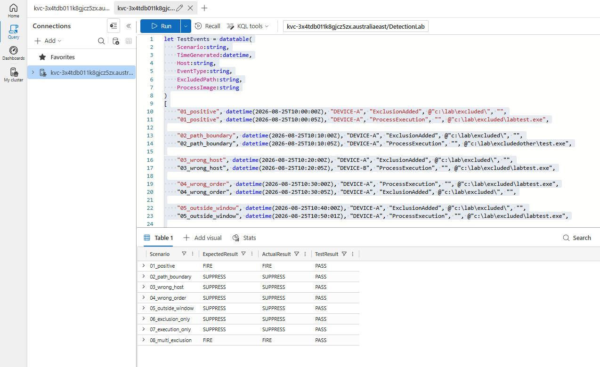
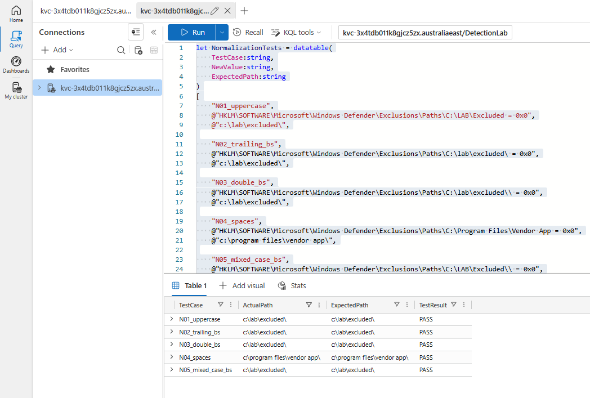

[defender_exclusion_then_execution_detection (1).md](https://github.com/user-attachments/files/31422118/defender_exclusion_then_execution_detection.1.md)
# Defender Exclusion Added → Execution From Excluded Path

**MITRE ATT&CK:** T1562.001 (Impair Defenses: Disable or Modify Tools), T1204.002 (User Execution: Malicious File)
**Platform:** Azure Data Explorer (KQL)
**Status:** Complete

---

## Detection Overview

This detection correlates two events that are individually unremarkable and jointly high-signal:

1. A Microsoft Defender **path exclusion being added** (Defender Event ID 5007)
2. A **process executing from inside that excluded path** (Sysmon Event ID 1), on the same host, within 10 minutes

Neither event alone justifies an alert. Administrators, installers and line-of-business software add Defender exclusions routinely, and processes execute from directories constantly. The detection targets the *sequence*: an attacker carving out a blind spot and then immediately using it.

This is the first detection in this repository written in KQL rather than Splunk SPL, and the first to use stateful sequence matching rather than a join.

---

## Scenario

An attacker with local administrator rights adds a Defender path exclusion, places a payload in the newly excluded directory, and executes it. Defender does not scan the path, so no malware detection event is ever produced. The remaining evidence is the configuration change and the process creation — which is what this detection consumes.

---

## Data Sources

| Source | Event | Fields used |
|---|---|---|
| Microsoft Defender operational log | Event ID 5007 (configuration changed) | `NewValue`, `OldValue`, `Host`, `TimeGenerated` |
| Sysmon | Event ID 1 (process creation) | `Image`, `ParentImage`, `CommandLine`, `ProcessGuid`, `ProcessId`, `Host`, `TimeGenerated` |

---

## Lab Environment

| Component | Version |
|---|---|
| Hypervisor | Proxmox VE |
| Endpoint OS | Windows 10 Pro 22H2, build 19045.6466 |
| Sysmon | v15.15 |
| Defender platform | 4.18.26070.9 |
| Defender signature | 1.457.331.0 |
| Analytics | Azure Data Explorer, database `DetectionLab` |
| Tables | `DefenderConfigEvents`, `SysmonProcessEvents` |

Sysmon v15.15 ran the existing home-lab configuration. That configuration captured Process Create (EID 1), but did not capture the tested Defender exclusion registry modification as EID 12/13 — so the exclusion side of this detection is sourced entirely from Defender's own 5007 event rather than from Sysmon registry telemetry.

---

## Attack Simulation Steps

1. Add a Defender path exclusion:

   ```
   powershell.exe -NoProfile -Command "Add-MpPreference -ExclusionPath 'C:\Lab\Excluded'"
   ```

2. Place a test binary in the excluded directory. `labtest.exe` is a copy of a legitimate signed Windows binary, so the detection is not relying on the payload itself looking suspicious:

   ```
   cp C:\Windows\System32\whoami.exe C:\Lab\Excluded\labtest.exe
   ```

3. Execute the binary from the excluded path.
4. Confirm Defender 5007 and Sysmon EID 1 both landed in ADX.

Using a signed Microsoft binary as the payload is deliberate. The detection fires on the *sequence*, not on any property of the executable — a detection that only worked against obviously-malicious binaries would not be testing its own logic.

---

## Detection Logic

Full query: [`kql/defender_exclusion_then_execution_detection.kql`](kql/defender_exclusion_then_execution_detection.kql)

### Design decisions

**`scan` rather than `join`.** A join produces a cross product of every exclusion against every execution and then filters it. That does not express "the next execution after this exclusion", and it does not scale. The `scan` operator walks the event stream in time order and maintains per-partition state, which is the correct shape for sequence detection.

**Partition key is `Host + CorrelationPath`, not `Host`.** `scan` step state holds only the most recent match. Partitioning on host alone means a second exclusion overwrites the first in state, so an attacker who adds two exclusions and executes from the first is missed entirely. Including the path in the key gives every exclusion its own independent state machine.

This was found by testing rather than by design. The initial version partitioned on `Host` and failed scenario `08_multi_exclusion`, which was written specifically to attack the state model.

**Path normalization.** Defender writes exclusion paths into the registry value with inconsistent casing and inconsistent trailing backslashes. Each path is lowercased, stripped of trailing backslashes, then given exactly one, so `C:\LAB\Excluded`, `c:\lab\excluded\` and `c:\lab\excluded\\` all become `c:\lab\excluded\`. The single trailing backslash is what stops `c:\lab\excludedother\` matching `c:\lab\excluded\`.

**Recursive matching via ancestor expansion.** Defender path exclusions are recursive: excluding `c:\lab\excluded\` also excludes `c:\lab\excluded\sub\`. Because the partition key makes matching an equality test, each execution is expanded into one candidate row per ancestor directory — `c:\lab\excluded\sub\labtest.exe` becomes candidates for `c:\`, `c:\lab\`, `c:\lab\excluded\` and `c:\lab\excluded\sub\`. The candidate matching a real exclusion lands in that partition and fires; the rest sit in partitions containing no exclusion and produce nothing.

Confirmed against real telemetry, not just synthetically: an exclusion on `c:\lab\excluded\` correctly detected execution of `c:\lab\excluded\sub\labtest.exe`.

**Correlation window:** 10 minutes, inclusive.

---

## Validation

Validation was done in two layers: synthetic scenarios asserting expected behaviour, and confirmation against real lab telemetry.

### Suppression matrix — 8/8 PASS

Query: [`kql/defender_exclusion_validation_matrix.kql`](kql/defender_exclusion_validation_matrix.kql)

| Scenario | Expected | Actual | Result |
|---|---|---|---|
| `01_positive` | FIRE | FIRE | PASS |
| `02_path_boundary` | SUPPRESS | SUPPRESS | PASS |
| `03_wrong_host` | SUPPRESS | SUPPRESS | PASS |
| `04_wrong_order` | SUPPRESS | SUPPRESS | PASS |
| `05_outside_window` | SUPPRESS | SUPPRESS | PASS |
| `06_exclusion_only` | SUPPRESS | SUPPRESS | PASS |
| `07_execution_only` | SUPPRESS | SUPPRESS | PASS |
| `08_multi_exclusion` | FIRE | FIRE | PASS |



Six of the eight scenarios assert that the detection stays *silent*. That is deliberate: a detection that only ever demonstrates firing has not been shown to be usable, because nothing establishes its false-positive behaviour.

**Harness design note.** `Scenario` is included in the validation partition key so that each synthetic scenario is evaluated in isolation and cannot inherit `scan` state from the scenario before it. This is test isolation only — the production detection has no `Scenario` field and partitions on `Host + CorrelationPath`.

### Normalization tests — 5/5 PASS

Query: [`kql/defender_exclusion_path_normalization_tests.kql`](kql/defender_exclusion_path_normalization_tests.kql)

Kept separate from the correlation matrix on purpose. The correlation logic compares already-normalized values, so a case-sensitivity test placed there would pass whether or not `tolower()` were present — it could not fail. These tests run against the raw 5007 string, so they can.



### Real telemetry

| Check | Screenshot |
|---|---|
| Defender 5007 exclusion added | `defender_5007_exclusion_added.png` |
| Sysmon EID 1 execution from excluded path | `sysmon_eid1_execution_from_excluded_path.png` |
| 5007 exclusion path extraction | `kql_extract_defender_exclusion_path.png` |
| Path normalization on live data | `kql_normalize_excluded_path.png` |
| Two sources normalized into one ordered stream | `kql_normalized_event_stream.png` |
| Positive correlation on real telemetry | `kql_final_real_telemetry_detection.png` |
| Sysmon EID 1 subdirectory execution | `sysmon_eid1_subdirectory_execution.png` |
| Recursive subdirectory execution detected | `kql_subdirectory_recursive_detection.png` |
| Path boundary suppressed on real telemetry | `kql_real_path_boundary_suppression.png` |

---

## Investigation Steps

When this fires:

1. Identify **who** added the exclusion — 5007 records the change but not the actor. Pivot to Sysmon EID 1 / Windows Security 4688 around `ExclusionTime` for `powershell.exe`, `MpCmdRun.exe` or `reg.exe` on the same host.
2. Establish whether the exclusion was expected — a known software install path, or a ticketed change?
3. Examine the executed binary: signature status, parent process, hash reputation, and whether it existed before the exclusion was added.
4. Check for further exclusions on the host — attackers rarely add just one.
5. Look for the same exclusion path appearing on other hosts, which would suggest tooling or policy rather than a single operator.

---

## False-Positive Considerations

Expected benign sources:

- **Software installers** that add an exclusion and immediately launch from the install directory. This is the dominant false positive.
- **Security tooling deployment or AV migration**, which legitimately excludes its own directories.
- **Developer machines** where build output directories are excluded for performance and then executed from.

Practical tuning: allow-list known-good installer paths and signed publisher directories rather than widening the correlation window, and consider suppressing where the executing binary is signed by a trusted publisher.

---

## Known Limitations

Stated explicitly rather than implied away:

- **Wildcard exclusions are not handled.** Defender supports wildcards in exclusion paths (`c:\lab\*\`). The normalization chain treats the wildcard as a literal character, so such exclusions will not correlate.
- **Only exclusion *additions* are detected.** The 5007 regex matches paths being set. An attacker abusing a **pre-existing** exclusion produces no 5007 event and is invisible here. Detecting that requires periodic exclusion-inventory baselining, not event correlation.
- **Process and extension exclusions are out of scope.** Only `Exclusions\Paths` is parsed.
- **The exclusion actor is not captured.** 5007 records the change, not the process or user that made it; attribution requires the pivot described above.
- **Registry-side corroboration was unavailable.** The Sysmon configuration in use did not capture the exclusion registry write as EID 12/13, so the exclusion signal has a single source. A Sysmon config covering `Exclusions\Paths` registry writes would give a second, independent view of the same action.
- **Nested exclusions are untested.** If a host has both `c:\lab\` and `c:\lab\excluded\` excluded, one execution may match both and emit duplicate rows. This case was not produced in the lab; a deduplication approach is noted in the query comments but is not part of the validated logic.

---

## Cleanup

```powershell
Remove-MpPreference -ExclusionPath "C:\Lab\Excluded"
Remove-Item -Recurse -Force "C:\Lab\Excluded", "C:\Lab\ExcludedOther", "C:\Lab\Alpha", "C:\Lab\Beta"
```

Confirm the exclusion is gone:

```powershell
(Get-MpPreference).ExclusionPath
```
