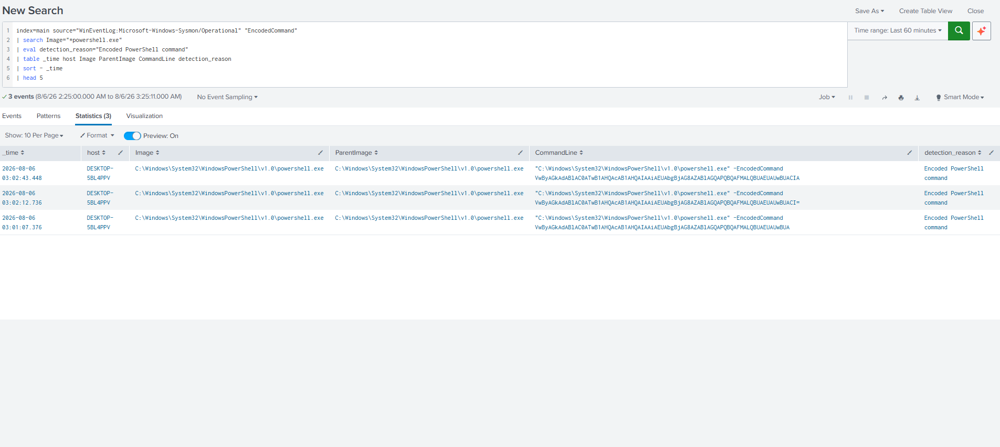
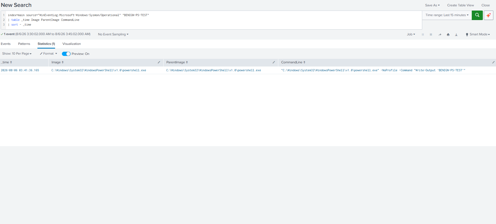
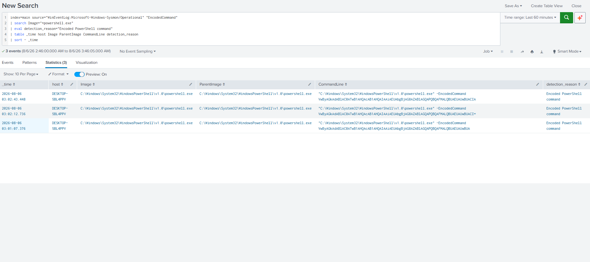
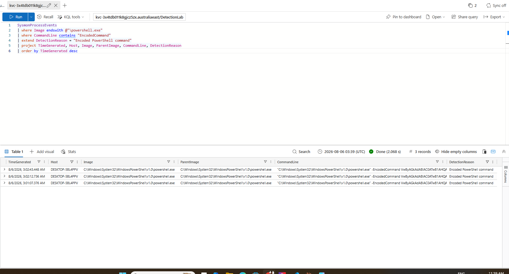
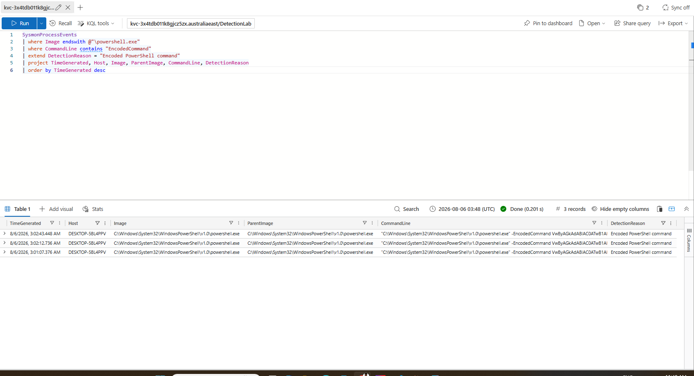

# Detection 2 — Encoded PowerShell

Dual-SIEM detection for identifying PowerShell processes launched with an
encoded command.

The same Sysmon process events were detected in Splunk SPL, exported, ingested
into Azure Data Explorer, and tested using KQL.

---

## Detection objective

Identify PowerShell processes whose command line contains `EncodedCommand`.

Encoded PowerShell is not automatically malicious, but attackers commonly use
encoding to hide scripts and make command-line activity harder to read.

This detection is intended to generate an investigation lead rather than prove
that compromise occurred.

## Data source

| Platform | Data source |
|---|---|
| Windows | Sysmon Event ID 1 — Process Create |
| Splunk | `index=main`, source `WinEventLog:Microsoft-Windows-Sysmon/Operational` |
| KQL test | Azure Data Explorer `SysmonProcessEvents` mirror table |
| Test endpoint | Windows 10 lab VM |

## MITRE ATT&CK mapping

| Technique | ID | Notes |
|---|---|---|
| PowerShell | **T1059.001** | PowerShell execution |
| Obfuscated/Compressed Files and Information | **T1027** | Encoded command content may conceal the original instruction |

## SPL query

See [`detection.spl`](./detection.spl).

The query searches Sysmon process-creation events for:

- A process image ending in `powershell.exe`
- A command line containing `EncodedCommand`

## KQL query

See [`detection.kql`](./detection.kql).

The KQL query was tested in Azure Data Explorer using Sysmon events exported
from Splunk and ingested into the `SysmonProcessEvents` table.

## Field mapping

| Detection concept | Splunk Sysmon field | ADX/KQL mirror field |
|---|---|---|
| Timestamp | `_time` | `TimeGenerated` |
| Host | `host` | `Host` |
| Event identifier | `EventID` | `EventID` |
| Process GUID | `ProcessGuid` | `ProcessGuid` |
| Process ID | `ProcessId` | `ProcessId` |
| Process image | `Image` | `Image` |
| Parent process | `ParentImage` | `ParentImage` |
| Command line | `CommandLine` | `CommandLine` |

## Test activity

A safe encoded PowerShell command was executed in the Windows VM.

The decoded command only printed:

```text
ENCODED-PS-TEST
```

A normal, non-encoded PowerShell command was also executed as a benign control:

```text
BENIGN-PS-TEST
```

Sysmon captured both types of execution.

## Testing method

### SPL test

1. Execute the safe encoded PowerShell command.
2. Confirm Sysmon Event ID 1 exists in Windows Event Viewer.
3. Confirm the event reaches Splunk.
4. Run `detection.spl`.
5. Confirm the encoded executions are returned.
6. Execute the benign PowerShell control.
7. Confirm the benign event is captured by Splunk.
8. Rerun the detection and confirm the benign event is excluded.

### KQL test

1. Export the encoded PowerShell Sysmon events from Splunk as CSV.
2. Create the `SysmonProcessEvents` table in Azure Data Explorer.
3. Map the Splunk CSV fields to the KQL table columns.
4. Ingest the three encoded events.
5. Run `detection.kql`.
6. Export and ingest the benign PowerShell event.
7. Confirm the table contains four events total.
8. Rerun the KQL detection and confirm only the three encoded events are returned.

## Results

| Test | Events present | Detection results | Expected |
|---|---:|---:|---|
| Encoded PowerShell | 3 | 3 | Detected |
| Benign PowerShell | 1 | 0 | Excluded |
| Total ADX events | 4 | 3 | Only encoded executions returned |

Both SPL and KQL returned the three encoded PowerShell executions.

The benign PowerShell event was present in the telemetry but was not returned
by either detection.

## Evidence

### SPL encoded PowerShell result

Splunk returned the three PowerShell executions containing `EncodedCommand`.



### SPL benign control captured

The benign PowerShell event was successfully captured by Sysmon and Splunk.



### SPL benign control excluded

The encoded-command detection continued to return only the three encoded
executions.



### KQL encoded PowerShell result

KQL returned the same three exported Sysmon events.



### KQL benign control excluded

After the benign event was added, the ADX table contained four events, while
the KQL detection continued to return only the three encoded executions.



## SPL and KQL equivalence

| Detection step | SPL | KQL |
|---|---|---|
| Select Sysmon data | `index=main source=...` | `SysmonProcessEvents` |
| Select PowerShell | `Image="*powershell.exe"` | `Image endswith @"\powershell.exe"` |
| Find encoded execution | `"EncodedCommand"` | `CommandLine contains "EncodedCommand"` |
| Add explanation | `eval detection_reason=...` | `extend DetectionReason=...` |
| Select output fields | `table` | `project` |
| Sort newest first | `sort - _time` | `order by TimeGenerated desc` |

## False positives

Possible legitimate activity includes:

- Administrative scripts using encoded PowerShell
- Software deployment platforms
- Endpoint-management tools
- Security testing or automation
- Incident-response tooling

Encoded execution should therefore be combined with additional context such as:

- Parent process
- User account
- Network connections
- Download activity
- Script contents
- Execution policy changes
- Hidden-window arguments

## Limitations

- The current rule searches for the full term `EncodedCommand`.
- It may miss abbreviated PowerShell parameters such as `-enc` or `-e`.
- It currently targets `powershell.exe` and may miss `pwsh.exe`.
- Encoding by itself does not confirm malicious activity.
- The exported Splunk CSV did not contain a populated `EventID` value, so the
  ADX test query did not filter on `EventID == 1`.
- A production implementation should restore the Event ID filter when the
  source schema reliably populates it.
- The ADX table is a test mirror and not a live Microsoft Sentinel or Defender
  process-event table.
- The rule does not yet score strong and weak indicators.

These limitations will be addressed in the later ClickFix lineage detection.

## Tested vs schema-validated status

| Implementation | Status |
|---|---|
| SPL (`detection.spl`) | **Tested** against live Sysmon events from the Windows lab VM |
| KQL (`detection.kql`) | **Tested** in Azure Data Explorer against the same Sysmon events exported from Splunk |
| Benign control | **Tested** and excluded in both SPL and KQL |
| Production Sentinel deployment | **Not deployed** |
| Defender `DeviceProcessEvents` version | **Not yet created or tested** |
