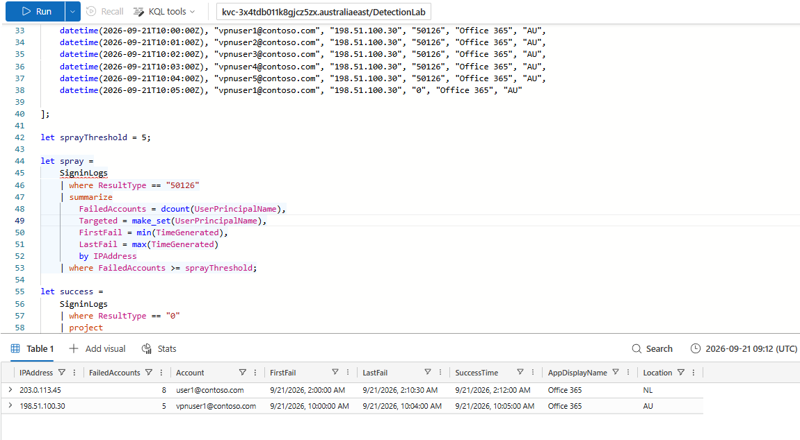
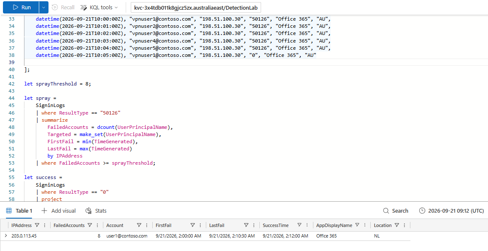
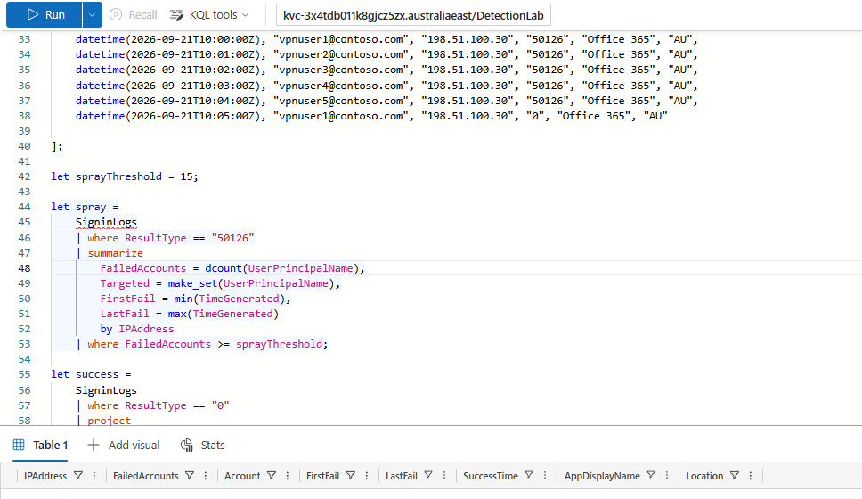

# Entra ID Password Spray Followed by Successful Sign-In

Sentinel-ready KQL detection for identifying a password spray from one source IP
across multiple Microsoft Entra ID accounts, followed by a successful sign-in
to one of the targeted accounts.

The detection was tested in Azure Data Explorer using synthetic `SigninLogs`
data. It has not been deployed to Microsoft Sentinel.

---

## Detection objective

Detect a single source IP that:

1. Generates invalid-password failures against at least 8 distinct accounts.
2. Produces a successful sign-in to one of those same targeted accounts.
3. Has that success occur during the spray or within 15 minutes after the last
   observed failed attempt.

The goal is to identify password spraying that may have resulted in account
compromise while reducing noise from normal user password mistakes.

## Data source

| Platform | Data source |
|---|---|
| Microsoft Entra ID | `SigninLogs` |
| Test substrate | Synthetic `SigninLogs` data in Azure Data Explorer |
| Production target | Microsoft Sentinel |

Key fields used:

- `TimeGenerated`
- `UserPrincipalName`
- `IPAddress`
- `ResultType`
- `AppDisplayName`
- `Location`

## MITRE ATT&CK mapping

| Technique | ID | Notes |
|---|---|---|
| Brute Force: Password Spraying | **T1110.003** | One source IP attempts authentication across multiple accounts |
| Valid Accounts: Cloud Accounts | **T1078.004** | Successful cloud sign-in to an account targeted during the spray |

## KQL query

The production-style KQL detection is available in:

[`detection.kql`](./detection.kql)

It is written against Microsoft Entra ID `SigninLogs` and is intended to be
Sentinel-ready.

The rule focuses on `ResultType == "50126"` for failed sign-ins and
`ResultType == "0"` for successful sign-ins.

For this first version, only `50126` is included to keep the detection scoped to
invalid username/password activity and avoid mixing in unrelated authentication
failure conditions.

## Testing method

The detection was validated in Azure Data Explorer using synthetic sign-in data.

The test dataset included:

| Scenario | Pattern | Expected result |
|---|---|---|
| Simulated password spray | 8 distinct accounts failed from one IP, followed by a success to one targeted account | Should fire |
| Single-user password typo | 2 failed attempts from one user, followed by a successful sign-in | Should not fire |
| Shared corporate egress | Multiple successful sign-ins, no failures | Should not fire |
| Corporate VPN with genuine typos | 5 different staff accounts failed from one shared IP, followed by a legitimate success | Should not fire at the tuned threshold |

The threshold was deliberately tested at `5`, `8`, and `15` to compare false-positive and false-negative behaviour.
The reproducible Azure Data Explorer test harness is available in:

[`test-data/adx-test-harness.kql`](./test-data/adx-test-harness.kql)

## Validation results

The threshold testing produced the following results:

| Threshold | Simulated attack | Corporate VPN typo case | Outcome |
|---|---|---|---|
| `5` | Fired | Fired | Too sensitive — false positive |
| `8` | Fired | Suppressed | Tuned result |
| `15` | Suppressed | Suppressed | Too high — false negative |

The final threshold was set to `8` distinct failed accounts.

At `5`, the benign corporate VPN scenario triggered because five different staff
accounts generated invalid-password failures behind the same shared IP.

At `8`, the simulated password spray still triggered while all benign scenarios
remained quiet.

At `15`, the simulated attack was missed because it targeted only eight accounts.

## Evidence

### Threshold 5 — false positive

At a threshold of `5`, both the simulated attacker and the benign corporate VPN
scenario triggered.

### Threshold 8 — tuned detection

At the tuned threshold of `8`, only the simulated password spray triggered.

### Threshold 15 — false negative

At a threshold of `15`, the simulated password spray was missed.

## False positives

Potential false positives include:

- Multiple employees mistyping passwords behind the same corporate VPN or shared egress IP.
- Shared office networks where several users generate authentication failures from one public IP.
- Password changes or expired cached credentials causing repeated failed sign-ins.
- Automated systems or legacy applications retrying invalid stored credentials.

Possible tuning options include:

- Adjusting the distinct-account threshold for the environment.
- Excluding known trusted corporate egress or VPN IP ranges.

## Limitations

- The threshold of `8` is static and should be tuned for the environment.
- A slow password spray that targets fewer than eight accounts within the query window may be missed.
- Shared corporate VPN or NAT IPs can still create noise in larger environments.
- The detection currently focuses only on `ResultType == "50126"`.
- Additional authentication failure codes may provide broader coverage but could also increase false positives.
- A successful sign-in after the spray increases confidence, but it does not by itself prove malicious account compromise.
- The detection was tested in Azure Data Explorer using synthetic data and has not been deployed in Microsoft Sentinel.
- This v1 covers interactive user sign-ins in `SigninLogs`. Non-interactive user sign-ins are logged separately in `AADNonInteractiveUserSignInLogs` and are out of scope for this version.

## Investigation steps

If this detection fires:

1. Review the source `IPAddress` and confirm whether it belongs to a trusted VPN, proxy, or corporate egress range.
2. Review the targeted accounts in `Targeted` and identify whether they belong to the same team, department, or access pattern.
3. Check the successful account in `Account` and review its recent sign-in history.
4. Compare the source location, application, device, and timing with the user's normal activity.
5. Look for follow-on activity after the successful sign-in, such as mailbox access, privilege changes, MFA changes, or unusual cloud activity.
6. Escalate if the successful sign-in appears inconsistent with expected user behaviour or trusted network activity.

## Tested vs deployed status

| Component | Status |
|---|---|
| Synthetic test data | Tested in Azure Data Explorer |
| KQL detection logic | Tested in Azure Data Explorer |
| Threshold tuning | Tested at `5`, `8`, and `15` |
| `ResultType` data type | Confirmed as `string` in Azure Data Explorer |
| Microsoft Sentinel deployment | Not deployed |
| Production status | Sentinel-ready KQL detection |
