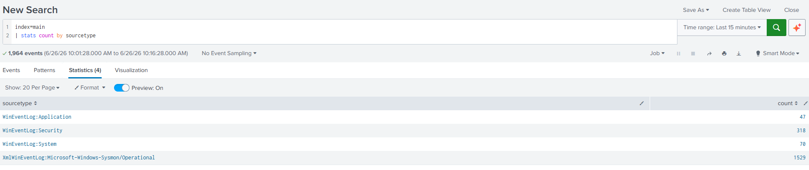
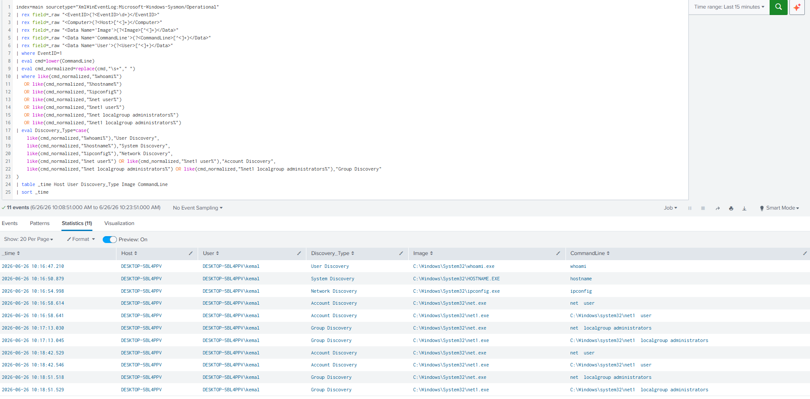
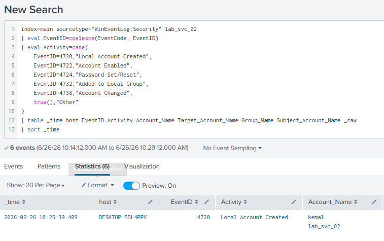
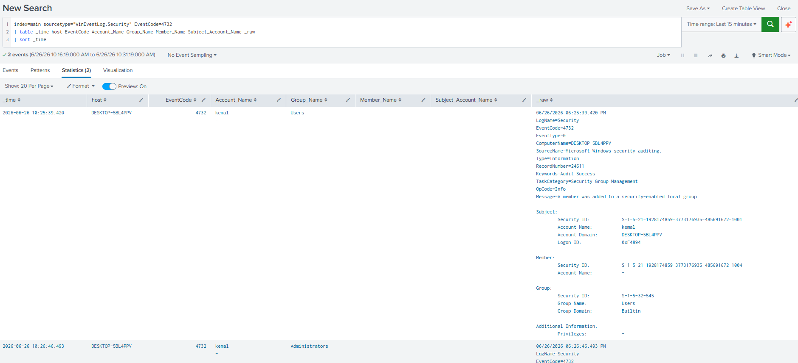
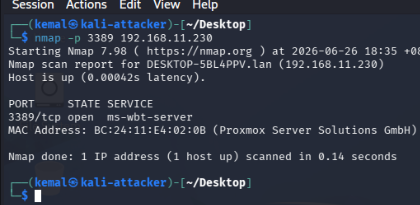
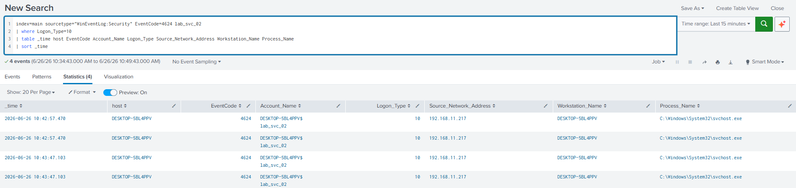
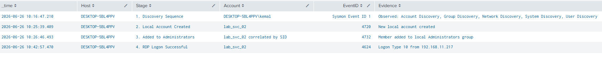
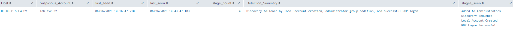
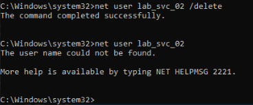

# Local Account Admin + RDP Attack Chain Detection

## Detection Overview

This detection identifies a suspicious Windows post-compromise sequence where discovery activity is followed by local account creation, administrator group modification, and a successful Remote Desktop logon.

Instead of alerting on a single event, this detection correlates multiple behaviours into an analyst-friendly attack-chain timeline.

## Scenario

A simulated attacker performs discovery on a Windows endpoint, creates a new local account, adds that account to the local Administrators group, and then successfully logs in over RDP.

Attack chain:

1. Discovery commands executed on the endpoint
2. New local account created
3. Account added to the local Administrators group
4. Successful RDP logon using the newly created account

Test account used:

```text
lab_svc_02
```

## MITRE ATT&CK Mapping

| Tactic                                                                | Technique                                | ID        |
| --------------------------------------------------------------------- | ---------------------------------------- | --------- |
| Discovery                                                             | System Owner/User Discovery              | T1033     |
| Discovery                                                             | System Information Discovery             | T1082     |
| Discovery                                                             | System Network Configuration Discovery   | T1016     |
| Discovery                                                             | Account Discovery                        | T1087     |
| Discovery                                                             | Permission Groups Discovery              | T1069     |
| Persistence                                                           | Create Account: Local Account            | T1136.001 |
| Persistence / Privilege Escalation                                    | Account Manipulation                     | T1098     |
| Defense Evasion / Persistence / Privilege Escalation / Initial Access | Valid Accounts                           | T1078     |
| Lateral Movement                                                      | Remote Services: Remote Desktop Protocol | T1021.001 |

## Data Sources

| Source             |            Event ID | Purpose                                  |
| ------------------ | ------------------: | ---------------------------------------- |
| Sysmon Operational |                   1 | Process creation and discovery commands  |
| Windows Security   |                4720 | Local account created                    |
| Windows Security   |                4722 | Account enabled                          |
| Windows Security   |                4724 | Password set or reset attempt            |
| Windows Security   |                4732 | Member added to local security group     |
| Windows Security   |                4738 | User account changed                     |
| Windows Security   |                4624 | Successful logon                         |
| Windows Security   | 4624, Logon Type 10 | Successful RDP / RemoteInteractive logon |

## Lab Environment

* Proxmox VE
* Windows 10 endpoint
* Sysmon
* Splunk Enterprise
* Splunk Universal Forwarder
* Kali Linux attacker VM

## Attack Simulation

Discovery commands executed on the Windows endpoint:

```cmd
whoami
hostname
ipconfig
net user
net localgroup administrators
```

Local account creation and administrator group modification:

```cmd
net user lab_svc_02 /add
net user lab_svc_02 *
net localgroup administrators lab_svc_02 /add
```

RDP logon was then performed using the newly created account.

Cleanup after validation:

```cmd
net localgroup administrators lab_svc_02 /delete
net user lab_svc_02 /delete
net user lab_svc_02
```

## Detection Logic

The detection correlates four stages:

| Stage | Behaviour                                      |
| ----- | ---------------------------------------------- |
| 1     | Discovery sequence observed                    |
| 2     | Local account created                          |
| 3     | Account added to local Administrators group    |
| 4     | Successful RDP logon using the created account |

A single local account creation event can be legitimate administrative activity. However, a sequence of discovery, account creation, administrator group addition, and RDP logon within a short time window is much higher-confidence and more useful for SOC triage.

## Splunk Detection Query — Attack Chain Timeline

```spl
index=main sourcetype="XmlWinEventLog:Microsoft-Windows-Sysmon/Operational"
| rex field=_raw "<EventID>(?<EventID>\d+)</EventID>"
| rex field=_raw "<Computer>(?<Host>[^<]+)</Computer>"
| rex field=_raw "<Data Name='CommandLine'>(?<CommandLine>[^<]+)</Data>"
| rex field=_raw "<Data Name='User'>(?<User>[^<]+)</Data>"
| where EventID=1
| eval cmd=lower(CommandLine)
| eval cmd_normalized=replace(cmd,"\s+"," ")
| where like(cmd_normalized,"%whoami%")
   OR like(cmd_normalized,"%hostname%")
   OR like(cmd_normalized,"%ipconfig%")
   OR like(cmd_normalized,"%net user%")
   OR like(cmd_normalized,"%net1 user%")
   OR like(cmd_normalized,"%net localgroup administrators%")
   OR like(cmd_normalized,"%net1 localgroup administrators%")
| eval Discovery_Type=case(
    like(cmd_normalized,"%whoami%"),"User Discovery",
    like(cmd_normalized,"%hostname%"),"System Discovery",
    like(cmd_normalized,"%ipconfig%"),"Network Discovery",
    like(cmd_normalized,"%net user%") OR like(cmd_normalized,"%net1 user%"),"Account Discovery",
    like(cmd_normalized,"%net localgroup administrators%") OR like(cmd_normalized,"%net1 localgroup administrators%"),"Group Discovery"
)
| stats earliest(_time) as _time values(Discovery_Type) as discovery_types by Host User
| eval Stage="1. Discovery Sequence"
| eval Account=User
| eval EventID="Sysmon Event ID 1"
| eval Evidence="Observed: " . mvjoin(discovery_types,", ")
| table _time Host Stage Account EventID Evidence
| append [
    search index=main sourcetype="WinEventLog:Security" EventCode=4720 lab_svc_02
    | eval Host=host
    | eval Stage="2. Local Account Created"
    | eval Account="lab_svc_02"
    | eval EventID=EventCode
    | eval Evidence="New local account created"
    | table _time Host Stage Account EventID Evidence
]
| append [
    search index=main sourcetype="WinEventLog:Security" EventCode=4732 "Administrators"
    | eval Host=host
    | eval Stage="3. Added to Administrators"
    | eval Account="lab_svc_02 correlated by SID"
    | eval EventID=EventCode
    | eval Evidence="Member added to local Administrators group"
    | table _time Host Stage Account EventID Evidence
]
| append [
    search index=main sourcetype="WinEventLog:Security" EventCode=4624 lab_svc_02
    | where Logon_Type=10
    | eval Host=host
    | eval Stage="4. RDP Logon Successful"
    | eval Account="lab_svc_02"
    | eval EventID=EventCode
    | eval Evidence="Logon Type 10 from " . Source_Network_Address
    | stats earliest(_time) as _time first(Host) as Host first(Stage) as Stage first(Account) as Account first(EventID) as EventID first(Evidence) as Evidence
    | table _time Host Stage Account EventID Evidence
]
| sort _time
| table _time Host Stage Account EventID Evidence
```

## Splunk Detection Query — SOC Alert Summary

```spl
index=main sourcetype="XmlWinEventLog:Microsoft-Windows-Sysmon/Operational"
| rex field=_raw "<EventID>(?<EventID>\d+)</EventID>"
| rex field=_raw "<Computer>(?<Host>[^<]+)</Computer>"
| rex field=_raw "<Data Name='CommandLine'>(?<CommandLine>[^<]+)</Data>"
| where EventID=1
| eval cmd=lower(CommandLine)
| eval cmd_normalized=replace(cmd,"\s+"," ")
| where like(cmd_normalized,"%whoami%")
   OR like(cmd_normalized,"%hostname%")
   OR like(cmd_normalized,"%ipconfig%")
   OR like(cmd_normalized,"%net user%")
   OR like(cmd_normalized,"%net1 user%")
   OR like(cmd_normalized,"%net localgroup administrators%")
   OR like(cmd_normalized,"%net1 localgroup administrators%")
| eval Stage="Discovery Sequence"
| eval Evidence="Sysmon Event ID 1 discovery commands observed"
| table _time Host Stage Evidence
| append [
    search index=main sourcetype="WinEventLog:Security" EventCode=4720 lab_svc_02
    | eval Host=host
    | eval Stage="Local Account Created"
    | eval Evidence="Event 4720 - lab_svc_02 created"
    | table _time Host Stage Evidence
]
| append [
    search index=main sourcetype="WinEventLog:Security" EventCode=4732 "Administrators"
    | eval Host=host
    | eval Stage="Added to Administrators"
    | eval Evidence="Event 4732 - member added to local Administrators group"
    | table _time Host Stage Evidence
]
| append [
    search index=main sourcetype="WinEventLog:Security" EventCode=4624 lab_svc_02
    | where Logon_Type=10
    | eval Host=host
    | eval Stage="RDP Logon Successful"
    | eval Evidence="Event 4624 - Logon Type 10 from " . Source_Network_Address
    | table _time Host Stage Evidence
]
| stats
    earliest(_time) as first_seen
    latest(_time) as last_seen
    values(Stage) as stages_seen
    dc(Stage) as stage_count
    values(Evidence) as evidence
    by Host
| where stage_count>=4
| eval Suspicious_Account="lab_svc_02"
| eval Detection_Summary="Discovery followed by local account creation, administrator group addition, and successful RDP logon"
| convert ctime(first_seen) ctime(last_seen)
| table Host Suspicious_Account first_seen last_seen stage_count Detection_Summary stages_seen
```

## Validation Results

### Fresh Log Ingestion

Splunk was receiving fresh Sysmon and Windows Security logs before the simulation.



### Discovery Sequence

Sysmon Event ID 1 captured discovery commands including user discovery, system discovery, network discovery, account discovery, and group discovery.



### Local Account Creation

Windows Security logs captured account management events for `lab_svc_02`, including account creation, account enablement, password set/reset activity, and account modification.



### Administrator Group Addition

Windows Security Event ID 4732 showed a member being added to the local Administrators group.



### RDP Port Reachability

Port 3389 was reachable on the Windows endpoint before RDP logon testing.



### Successful RDP Logon

Windows Security Event ID 4624 with Logon Type 10 confirmed a successful RDP / RemoteInteractive logon using `lab_svc_02`.



### Correlated Attack Chain Timeline

The final timeline correlated discovery, local account creation, administrator group modification, and successful RDP logon.



### SOC Alert Summary

The SOC-style summary produced a single high-confidence alert view.



### Cleanup

The test account was removed after validation.



## Investigation Steps

If this detection fires, an analyst should:

1. Confirm whether the local account creation was expected.
2. Identify who created the account.
3. Check whether the account was added to privileged local groups.
4. Review successful logons using the new account.
5. Confirm source IP and workstation name for the RDP session.
6. Review nearby Sysmon process creation events for discovery or execution activity.
7. Disable the account if unauthorized.
8. Remove unauthorized group membership.
9. Preserve relevant logs for incident response.

## False Positive Considerations

Possible legitimate causes:

* Helpdesk creating a local support account
* System administrator adding a temporary local admin account
* Lab or maintenance activity
* Authorized RDP access after account provisioning

Why correlation improves signal quality:

* Event ID 4720 alone can be normal administrative activity.
* Event ID 4732 alone may happen during legitimate privilege assignment.
* Event ID 4624 Logon Type 10 alone may be normal RDP usage.
* The combined sequence of discovery, account creation, administrator group addition, and RDP logon is much more suspicious.

## Technical Notes

During testing, Windows generated both `net.exe` and `net1.exe` process creation events for some `net` commands. The detection normalizes command-line spacing and checks both binaries to avoid missing discovery activity.

The RDP session generated Logon Type 3 events before Logon Type 10. This can occur around RDP authentication behaviour such as Network Level Authentication. The detection focuses on Logon Type 10 as the stronger signal for successful RemoteInteractive logon.

## Severity

**High**

Reason: This sequence indicates a newly created local account was granted administrator-level access and then used for remote access. In a real environment, this could represent unauthorized persistence, privilege escalation, or lateral movement.

## Status

Validated in lab.
