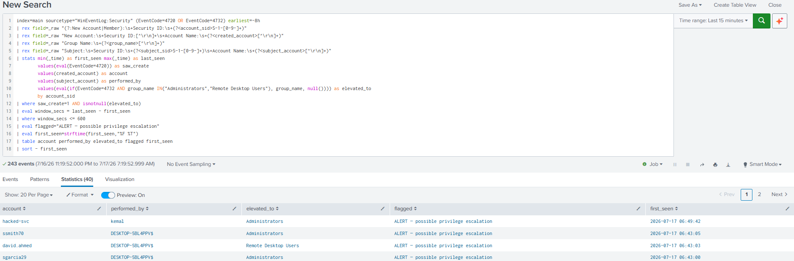
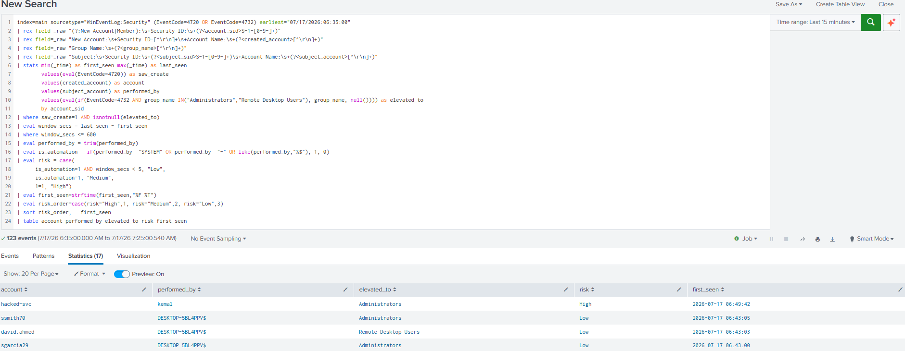
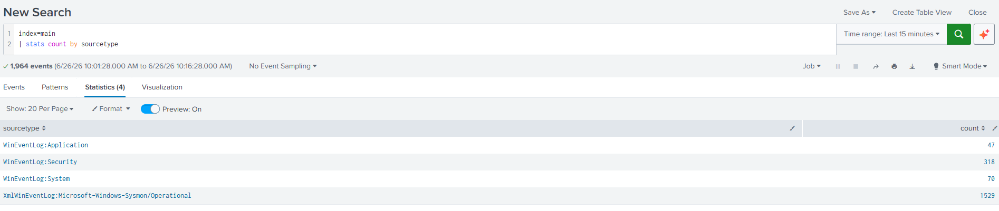
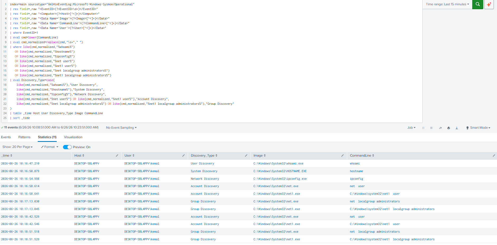
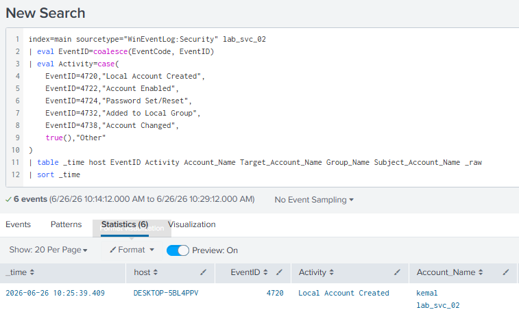
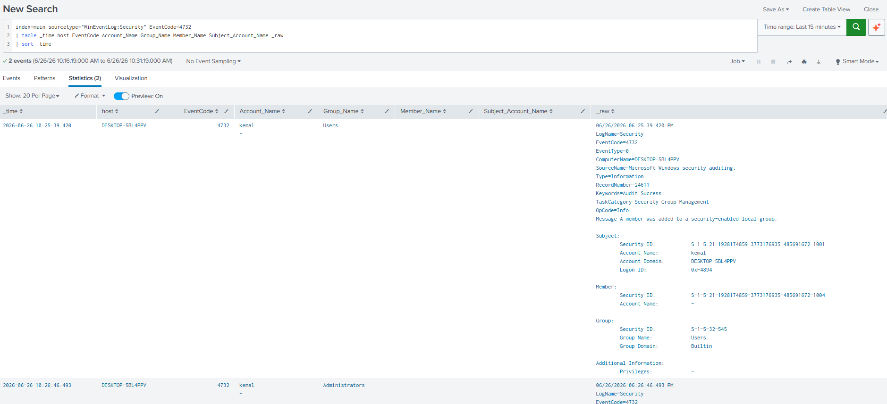
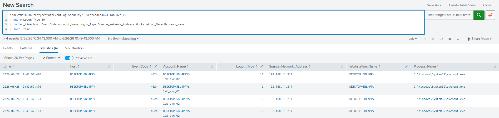
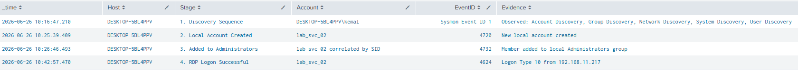
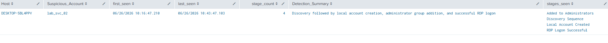

# Local Account Admin + RDP Attack Chain Detection

## Detection Overview

This detection identifies a suspicious Windows post-compromise sequence where a local
account is created, added to a privileged group, and then used — correlating multiple
behaviours into a single, risk-scored alert rather than firing on isolated events.

The detection has been through two iterations. The original version worked in the lab but
was **brittle** — it keyed on a hardcoded test-account name and faked its correlation. It
was then rebuilt to correlate on the account's **SID**, bind the sequence within a **time
window**, and **risk-score** each chain on *who performed it* — so legitimate automated
provisioning is triaged down while a real attacker stands out.

> **The full story of this rebuild — with a measured before/after — is written up here:**
> [From Lab-Brittle to Production-Ready: Tuning a Noisy Detection](../investigations/lab-brittle-to-production.md)

---

## Scenario

A simulated attacker creates a new local account, adds it to the local Administrators
group, and logs in over RDP:

1. Discovery commands executed on the endpoint
2. New local account created
3. Account added to the local Administrators group
4. Successful RDP logon using the newly created account

---

## MITRE ATT&CK Mapping

| Tactic | Technique | ID |
| --- | --- | --- |
| Discovery | System Owner/User Discovery | T1033 |
| Discovery | System Information Discovery | T1082 |
| Discovery | System Network Configuration Discovery | T1016 |
| Discovery | Account Discovery | T1087 |
| Discovery | Permission Groups Discovery | T1069 |
| Persistence | Create Account: Local Account | T1136.001 |
| Persistence / Privilege Escalation | Account Manipulation | T1098 |
| Defense Evasion / Persistence / Priv Esc / Initial Access | Valid Accounts | T1078 |
| Lateral Movement | Remote Services: Remote Desktop Protocol | T1021.001 |

---

## Data Sources

| Source | Event ID | Purpose |
| --- | ---: | --- |
| Sysmon Operational | 1 | Process creation and discovery commands |
| Windows Security | 4720 | Local account created (carries the new account's **name and SID**) |
| Windows Security | 4722 | Account enabled |
| Windows Security | 4724 | Password set or reset |
| Windows Security | 4732 | Member added to local group (records the member **by SID only**) |
| Windows Security | 4624 (Logon Type 10) | Successful RDP / RemoteInteractive logon |

A key fact that drives the whole correlation design: **Event 4732 records the added member
by SID, not by name** — the account-name field is blank. So this chain *cannot* be reliably
correlated by account name; the SID is the only stable join key. (This is why the original
rule's name-based approach was fundamentally unsound, not just brittle.)

---

## Detection Design — v1 (brittle) → v2 (tuned)

### v1 — the original, brittle version

The first version chained the four stages, but every stage searched for a **hardcoded
account name** (`lab_svc_02`), and stage 3 *faked* its correlation with a static string.

```spl
... | append [
    search index=main sourcetype="WinEventLog:Security" EventCode=4720 lab_svc_02
    | eval Stage="2. Local Account Created"
    | eval Account="lab_svc_02"
]
| append [
    search index=main sourcetype="WinEventLog:Security" EventCode=4732 "Administrators"
    | eval Stage="3. Added to Administrators"
    | eval Account="lab_svc_02 correlated by SID"   <-- static string; no correlation happens
]
| append [
    search index=main sourcetype="WinEventLog:Security" EventCode=4624 lab_svc_02
    | where Logon_Type=10
    | eval Stage="4. RDP Logon Successful"
]
| stats ... by Host | where stage_count>=4          <-- grouped only by Host, no time window
```

**What was wrong with it:**

1. **Hardcoded account name.** It only matched because the test account was named
   `lab_svc_02`. A real attacker choosing any other name would have been missed entirely.
2. **Faked correlation.** `eval Account="lab_svc_02 correlated by SID"` is a literal string.
   No SID was ever extracted or matched — the rule *claimed* a correlation it didn't perform.
3. **No shared join key.** Each stage independently searched for the same hardcoded name, so
   the "chain" was held together by a constant, not by evidence that the same account moved
   through all four stages.
4. **No time-binding.** Stages were grouped `by Host` with `stage_count>=4` and no time
   window, so four unrelated events days apart on the same host would still "chain."
5. **Name-based correlation was impossible anyway** — see the 4732 note above.

### v2 — the tuned, corrected version

The rebuild extracts the account **SID** from *both* the 4720 (`New Account:` block) and the
4732 (`Member:` block) into a **single normalised field**, correlates on it with `stats`,
enforces a **time window**, and **risk-scores** each chain on the **Subject** — the identity
that performed the action.

```spl
index=main sourcetype="WinEventLog:Security" (EventCode=4720 OR EventCode=4732) earliest=-24h
| rex field=_raw "(?:New Account|Member):\s+Security ID:\s+(?<account_sid>S-1-[0-9-]+)"
| rex field=_raw "New Account:\s+Security ID:[^\r\n]+\s+Account Name:\s+(?<created_account>[^\r\n]+)"
| rex field=_raw "Group Name:\s+(?<group_name>[^\r\n]+)"
| rex field=_raw "Subject:\s+Security ID:\s+(?<subject_sid>S-1-[0-9-]+)\s+Account Name:\s+(?<subject_account>[^\r\n]+)"
| stats min(_time) as first_seen max(_time) as last_seen
        values(eval(EventCode=4720)) as saw_create
        values(created_account) as account
        values(subject_account) as performed_by
        values(eval(if(EventCode=4732 AND group_name IN("Administrators","Remote Desktop Users"), group_name, null()))) as elevated_to
        by account_sid
| where saw_create=1 AND isnotnull(elevated_to)
| eval window_secs = last_seen - first_seen
| where window_secs <= 600
| eval performed_by = trim(performed_by)
| eval is_automation = if(performed_by=="SYSTEM" OR performed_by=="-" OR like(performed_by,"%$"), 1, 0)
| eval risk = case(
      is_automation=1 AND window_secs < 5, "Low",
      is_automation=1, "Medium",
      1=1, "High")
| eval risk_order = case(risk="High",1, risk="Medium",2, risk="Low",3)
| eval first_seen = strftime(first_seen,"%F %T"), last_seen = strftime(last_seen,"%F %T")
| sort risk_order, - first_seen
| table account account_sid performed_by elevated_to risk window_secs first_seen last_seen
```

**How each fix maps to each flaw:**

| v1 flaw | v2 fix |
| --- | --- |
| Hardcoded name | Extracts and correlates on the **SID** — works for any account name |
| Faked correlation | Real correlation via `stats ... by account_sid` |
| No shared join key | `(?:New Account\|Member)` normalises the SID from both events into one field |
| No time-binding | `window_secs <= 600` requires create + elevate within 10 minutes |
| Fires on all equally | **Risk scores** on the Subject: automation → Low, interactive user → High |

**Why `stats`, not `join` or `transaction`:** `join` relies on a subsearch that silently
caps at 50k results and can drop events under load; `transaction` is memory-heavy and
fragile at scale. `stats ... by <key>` correlates in a single pass and scales cleanly — the
standard way to correlate multiple event types in Splunk.

**Two implementation gotchas found during tuning** (both documented because they're easy to
repeat):

- The Subject on legitimately-automated activity is the **computer account**
  (e.g. `DESKTOP-5BL4PPV$`), not the literal string `SYSTEM`. The `like(performed_by,"%$")`
  test catches any machine account by its trailing `$`.
- The extracted `performed_by` can carry **trailing whitespace** from the raw event, which
  breaks an exact/`$` match. `trim()` is applied before the comparison.

---

## Validation

### Tuning result — before and after

The tuned rule was measured against a **benign baseline**: automated helpdesk-style account
provisioning (randomised names, a realistic privileged-account minority), performed by the
machine account.

**Before (no risk scoring):** every legitimate create-and-elevate chain was flagged
identically to an attack — 0% precision, all noise.



**After (risk-scored):** the one manually-run attack (performed by an interactive user) is
the only **High**; every automated benign chain is correctly triaged **Low** — with no
accounts filtered out, so detection coverage is intact.



A notable robustness point: the manual attack took ~5 minutes end-to-end versus sub-second
for automation, yet still scored High — because the discriminator is *who* performed the
action, not *how fast*. A slow attacker is caught as reliably as a fast one.

### Original chain validation (v1 evidence)

The following screenshots validate the underlying event collection and the four-stage chain
as originally built.

| Stage | Evidence |
| --- | --- |
| Fresh log ingestion |  |
| Discovery sequence |  |
| Local account creation |  |
| Administrator group addition |  |
| Successful RDP logon |  |
| Correlated timeline |  |
| SOC alert summary |  |

---

## Investigation Steps

If a **High**-risk chain fires, an analyst should:

1. Confirm whether the account creation was expected/change-ticketed.
2. Identify the Subject (`performed_by`) — a named interactive user is the concern.
3. Check what privileged group the account was added to (`elevated_to`).
4. Review any successful logons using the new account, and the source IP / workstation.
5. Review nearby Sysmon process-creation events for discovery or execution activity.
6. If unauthorized: disable the account, remove the group membership, preserve logs.

A **Low**-risk chain (machine-account / automation) is typically routine provisioning and
can be handled as an informational ticket rather than paged.

---

## False Positive Considerations

Legitimate causes of a create-and-elevate chain include helpdesk provisioning, a temporary
admin account, or maintenance activity. The tuning addresses these **behaviourally** rather
than by exclusion:

- The rule still **fires on every chain** — nothing is filtered out, so coverage is never
  reduced.
- Chains performed by automation / machine accounts are scored **Low**; only chains
  performed by interactive users escalate to **High**.
- Crucially, tuning was **not** done by excluding the benign account by name — that would
  reintroduce the original hardcoded flaw and blind the rule to any attacker using that name.

---

## Known Limitation

The behavioural discriminator has a real blind spot: an attacker who first escalates to a
**SYSTEM / machine-account context** would perform the chain as "automation" and score Low.
The honest next step is to layer a second signal — e.g. logon-session lineage or whether the
creating process has an interactive parent — rather than trusting the Subject alone.

---

## Next Iteration

- Extend the same SID-based correlation to **stage 4 (RDP logon, 4624 Type 10)**, matching
  the logon's target SID to the created account's SID, so the full four-stage chain is
  SID-correlated end to end.
- Add the second Subject-context signal noted under Known Limitation.
- Produce a Sigma version of the tuned logic for portability.

---

## Severity

**Risk-scored (High / Medium / Low)** rather than a flat rating. A create-and-elevate chain
performed by an interactive user is **High** — a strong indicator of unauthorized
persistence or privilege escalation. The same chain performed by automation is **Low**.

## Status

Tuned and validated in lab, with measured before/after false-positive behaviour.
