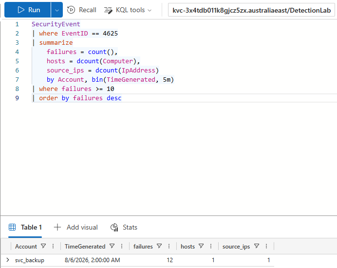
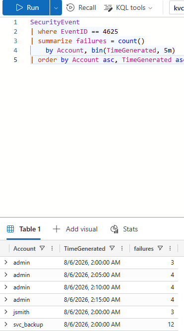
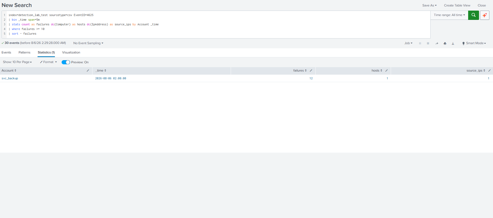
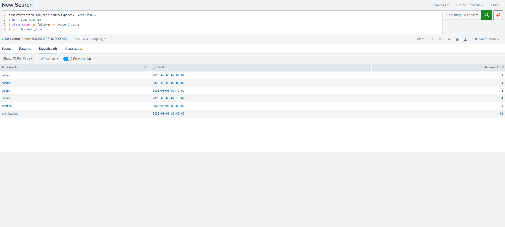

# Detection 1 — Multiple Failed Logons (burst)

Dual-SIEM detection: the same logic implemented in Splunk SPL and Microsoft KQL,
mapped to the same ATT&CK technique and validated against the same test data.

This is the **workflow-proving** detection. It establishes the repository format,
field-mapping process, and ADX test harness before the ClickFix case study.

---

## Detection objective

Flag any single account that accumulates **≥ 10 failed logons within a 5-minute
window**, indicating possible password guessing or brute-force activity against
one target.

This is distinct from a slow, low-volume attempt that remains below the
per-window threshold.

## Data source

| Platform | Data source |
|---|---|
| Event | Windows Security **Event ID 4625** — an account failed to log on |
| Splunk | `WinEventLog:Security` using normalised Windows Security log fields |
| Sentinel | `SecurityEvent` table through the Windows Security Events connector |
| Test substrate | Azure Data Explorer mirror table created using `test-data/adx-setup.kql` |

## MITRE ATT&CK mapping

| Technique | ID | Notes |
|---|---|---|
| Brute Force: Password Guessing | **T1110.001** | Primary mapping — many attempts against one account |
| Brute Force: Password Spraying | T1110.003 | Adjacent technique; a spraying detection would count distinct targeted accounts by source IP |

## SPL query

The production-style Splunk query is available in:

[`detection.spl`](./detection.spl)

It targets normalised Windows Security log fields such as `EventCode`, `user`,
`host`, and `src_ip`.

The exact query tested against the uploaded CSV is available in:

[`test-data/detection-test.spl`](./test-data/detection-test.spl)

## KQL query

The KQL detection is available in:

[`detection.kql`](./detection.kql)

It was tested in Azure Data Explorer using a `SecurityEvent`-compatible mirror
table and is intended for Microsoft Sentinel's documented `SecurityEvent` schema.

## Field mapping

See [`field-mapping.md`](./field-mapping.md) for the Splunk, Sentinel, and ADX
field crosswalk, including the difference between Splunk's schema-on-read model
and KQL's fixed table schema.

## Testing method

The dataset in `test-data/sample-4625-events.csv` contains 30 synthetic Windows
Security Event ID 4625 records across three accounts.

The data was designed so exactly one account should trigger the detection:

| Account | Pattern | Expected result |
|---|---|---|
| `svc_backup` | 12 failures within one 5-minute window | **Should fire** |
| `jsmith` | 3 failures | Should not fire |
| `admin` | 15 failures spread across 20 minutes, with no more than 4 in one window | Should not fire |

The `admin` events are intentionally distributed across multiple windows. This
tests whether the rule performs time-based burst detection rather than simply
counting all failures for an account.

### KQL test path

1. Create the `SecurityEvent` mirror table in Azure Data Explorer.
2. Ingest the sample events using `test-data/adx-setup.kql`.
3. Run `detection.kql`.
4. Remove the threshold filter to review the individual 5-minute windows.

### SPL test path

1. Upload `sample-4625-events.csv` into the Splunk index
   `detection_lab_test`.
2. Run `test-data/detection-test.spl`.
3. Run the window-breakdown query without the threshold filter.
4. Compare the result with the KQL output.

The production-style `detection.spl` was not tested directly against the CSV
because the CSV uses Sentinel-style field names rather than normalised Splunk
Windows-event fields.

## Results

Both tested implementations returned the same detection result:

| Account | 5-minute window | Failures | SPL test | KQL test | Expected |
|---|---|---:|---|---|---|
| `svc_backup` | 02:00 | 12 | Fires | Fires | **Fires** |
| `admin` | Any single window | ≤ 4 | Suppressed | Suppressed | Suppressed |
| `jsmith` | 02:00 | 3 | Suppressed | Suppressed | Suppressed |

Only `svc_backup` exceeded the threshold, producing one result row with
`failures = 12`.

The `admin` account had more than 10 failures overall, but the events were split
across four separate 5-minute windows. No individual window reached the
threshold.

## Evidence

### KQL detection result

Only `svc_backup` exceeded the threshold, with 12 failures in one 5-minute
window.

### KQL window breakdown

The `admin` failures were distributed across four separate windows, so the
account remained below the threshold.

### SPL detection result

The equivalent SPL test query also returned only `svc_backup`.

### SPL window breakdown

The SPL results confirm the same 5-minute grouping behaviour.

## SPL and KQL equivalence

The two implementations express the same detection logic using different
operators and field names:

| Detection step | SPL | KQL |
|---|---|---|
| Select failed logons | `EventID=4625` or `EventCode=4625` | `where EventID == 4625` |
| Create 5-minute windows | `bin _time span=5m` | `bin(TimeGenerated, 5m)` |
| Count by account and window | `stats count by Account _time` | `summarize count() by Account, bin(...)` |
| Apply threshold | `where failures >= 10` | `where failures >= 10` |
| Sort highest first | `sort - failures` | `order by failures desc` |

This demonstrates that the detection meaning was preserved while adapting to
the different schemas and query languages.

## False positives

Potential false positives include:

- Service or batch accounts repeatedly attempting authentication with expired
  cached credentials.
- Password rotation causing mapped drives, services, mobile clients, or saved
  sessions to retry an old password.
- Vulnerability scanners, network-access-control systems, or health-check tools
  performing repeated authentication attempts.
- Users repeatedly entering an incorrect password over a short period.

Possible tuning options include:

- Using different thresholds for service accounts.
- Prioritising specific logon types.
- Excluding documented scanner or automation source addresses.
- Correlating the failures with a later successful login.

## Limitations

- The threshold and 5-minute window are static.
- An attacker pacing attempts below 10 failures per window may evade the rule.
- Event ID 4625 alone does not confirm account compromise.
- The rule does not currently distinguish risk using `LogonType`.
- A successful Event ID 4624 after the failed attempts is not yet correlated.
- The ADX test table contains only the fields needed for this detection and is
  not a complete production Sentinel table.
- The production-style SPL query still needs testing against live,
  normalised Windows Security events from the lab.

A longer-window, lower-volume companion detection would improve coverage for
slow password-guessing activity.

## Tested vs schema-validated status

| Implementation | Status |
|---|---|
| SPL test query (`test-data/detection-test.spl`) | **Tested** in Splunk against the 30 synthetic Event ID 4625 records |
| SPL production query (`detection.spl`) | **Schema-validated** for normalised Windows Security log fields; not tested against the CSV because the field names differ |
| KQL (`detection.kql`) | **Tested** in Azure Data Explorer using a `SecurityEvent`-compatible mirror table populated with the sample events |
| Production Sentinel deployment | **Not deployed**; mapping was prepared for the documented `SecurityEvent` schema |
