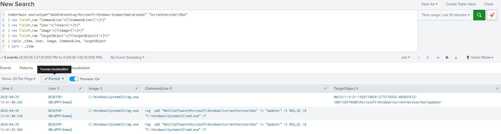
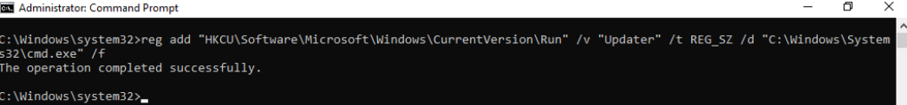

# Detection: Registry Run Key Persistence

## MITRE ATT&CK
T1547.001 – Boot or Logon Autostart Execution: Registry Run Keys

## Description
This detection identifies modifications to Windows Registry Run Keys, which cause programs to execute automatically at user logon.

Adversaries abuse these keys to establish persistence by registering malicious payloads that execute without user interaction.

This technique is widely used by malware families such as Emotet, Trickbot, and QakBot.

The primary registry paths targeted are:

- `HKCU\Software\Microsoft\Windows\CurrentVersion\Run` (per-user, no admin required)  
- `HKLM\Software\Microsoft\Windows\CurrentVersion\Run` (all users, requires admin)  

---

## Attack Simulation
To validate this detection, a registry Run Key entry was added on a Windows 10 endpoint:

```cmd
reg add "HKCU\Software\Microsoft\Windows\CurrentVersion\Run" /v "Updater" /t REG_SZ /d "C:\Windows\System32\cmd.exe" /f
```

This simulates an attacker establishing persistence by adding a malicious entry that executes at every user logon.

---

## Data Source
**Sysmon (Microsoft-Windows-Sysmon/Operational)**

Event IDs:
- **1 – Process Creation** (captures `reg.exe` execution)  
- **13 – Registry Value Set** (captures registry modifications)  

---

## Splunk Detection Query
```spl
index=main sourcetype="XmlWinEventLog:Microsoft-Windows-Sysmon/Operational"
| rex field=_raw "<EventID>(?<EventID>\d+)</EventID>"
| rex field=_raw "CommandLine\">(?<CommandLine>[^<]+)"
| rex field=_raw "User\">(?<User>[^<]+)"
| rex field=_raw "Image\">(?<Image>[^<]+)"
| rex field=_raw "TargetObject\">(?<TargetObject>[^<]+)"
| search EventID=13 AND TargetObject="*CurrentVersion\\Run*"
| where NOT match(TargetObject, "(?i)(GoogleUpdate|MicrosoftEdgeUpdate|SecurityHealth|Windows Defender)")
| table _time, User, Image, CommandLine, TargetObject
| sort - _time
```

---

## Investigation Steps
- Identify the modified registry key (`TargetObject`) and value name  
- Review the `/d` parameter to determine the executed binary or script  
- Determine if the change was made by a standard user or administrator  
- Analyse the parent process (`reg.exe` spawned from cmd.exe or PowerShell is suspicious)  
- Correlate with other persistence mechanisms (scheduled tasks, services)

---

## False Positives
Possible legitimate causes include:

- Software installations adding startup entries (e.g., Chrome, OneDrive)  
- Security tools registering startup components  
- IT management tools (SCCM/Group Policy)  
- User-installed applications  

---

## Severity
Medium-High

---

## Lab Validation
This detection was tested in a SOC detection engineering home lab by adding a registry Run Key entry on a Windows 10 endpoint.

Logs were collected using Sysmon (Event ID 1 and Event ID 13) and forwarded to Splunk via the Splunk Universal Forwarder.

---

## Screenshots

### Detection Output (Splunk)


### Attack Simulation (Command Execution)

