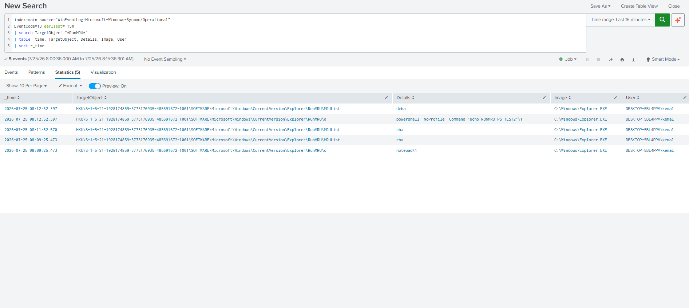
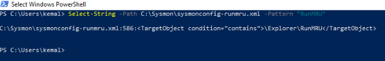

# Detection: RunMRU Interpreter Abuse (Run-Dialog Paste Evidence)

## MITRE ATT&CK Mapping
- T1204.004 – User Execution: Malicious Copy and Paste

---

## Description
This detection identifies the **forensic evidence that a command interpreter was typed into the Windows Run dialog** (`Win+R`) — the initial user action in a ClickFix / paste-and-run chain.

It is a **complementary** layer to the [ClickFix process-lineage detection](clickfix_powershell_lineage_detection.md): the lineage rule catches the *execution*, while this rule catches the durable *registry breadcrumb*. It survives even if the spawned process is missed and is inherently low-noise, because normal users rarely type `powershell`, `cmd`, or `mshta` into Run.

---

## The Artifact
Each command entered into the Run dialog is written to:

```
HKCU\Software\Microsoft\Windows\CurrentVersion\Explorer\RunMRU
```

- Each command is stored under a single-letter value (`a`, `b`, `c`, …).
- `MRUList` holds only the **ordering** metadata (e.g. `dcba`) — not a command — and must be excluded.
- Sysmon records these as **Event ID 13** (registry value set), with the command text in `Details` and `Explorer.EXE` as the writing image.

---

## Visibility Gap Found and Fixed
While building this detection I found Sysmon was **not capturing RunMRU writes**, even though Event ID 13 was otherwise flowing (~1,100/day).

1. `reg query "HKCU\Software\Microsoft\Windows\CurrentVersion\Explorer\RunMRU"` on the endpoint showed prior Run-dialog PowerShell commands **existed in the registry**, but Splunk returned zero matching Event ID 13s — proving the gap was Sysmon collection, not Splunk extraction.
2. Dumping the active config (`Sysmon64.exe -c`) showed the `RegistryEvent onmatch="include"` section covered paths like `CurrentVersion\Run` but **not** `\Explorer\RunMRU`.
3. Fixed by adding one include line and applying the config:

```xml
<!-- inside <RegistryEvent onmatch="include"> -->
<TargetObject condition="contains">\Explorer\RunMRU</TargetObject>
```
```cmd
Sysmon64.exe -c sysmonconfig-runmru.xml
```

> **The fix is not retroactive.** A Sysmon config change only affects *new* registry writes; historical RunMRU values already in the registry will never appear in Splunk. Also, re-entering an *existing* Run command may only reshuffle `MRUList` without writing a new value — so validation must use a **unique** command string to force a fresh value write.

---

## Attack Simulation
After updating the config, a unique command was entered via `Win+R`:

```powershell
powershell -NoProfile -Command "echo RUNMRU-PS-TEST2"
```

A benign `notepad` entry was also generated as a control.

---

## Data Source
**Sysmon (Microsoft-Windows-Sysmon/Operational)**
- Event ID 13 – Registry Value Set (requires the RunMRU include, above)

---

## Splunk Detection Query
```spl
index=main source="WinEventLog:Microsoft-Windows-Sysmon/Operational" EventCode=13
TargetObject="*\\Explorer\\RunMRU\\*"
NOT TargetObject="*\\MRUList"
| where match(
    Details,
    "(?i)^\s*(?:powershell(?:\.exe)?|pwsh(?:\.exe)?|cmd(?:\.exe)?|mshta(?:\.exe)?|wscript(?:\.exe)?|cscript(?:\.exe)?|rundll32(?:\.exe)?|regsvr32(?:\.exe)?)\b"
  )
| table _time, host, User, TargetObject, Details, Image
| sort - _time
```

Anchoring the interpreter match at the start of `Details` keeps it precise — it targets a command the user *ran*, not an interpreter name appearing incidentally later in a path. The `MRUList` exclusion drops the ordering-metadata event that would otherwise pair with every real hit.

---

## Validation
The `powershell -NoProfile -Command "echo RUNMRU-PS-TEST2"` entry was captured under `...\Explorer\RunMRU\d`, command in `Details`, `Explorer.EXE` as image, `MRUList` correctly excluded. The benign `notepad` control did **not** match (no interpreter keyword) — confirming the rule separates interpreter abuse from ordinary Run usage.

---

## Investigation Steps
1. Read the full `Details` value — this is the exact command the user typed into Run.
2. Decode any encoded/obfuscated portion.
3. Correlate by time and host with the [ClickFix process-lineage detection](clickfix_powershell_lineage_detection.md) to link the typed command to its execution.
4. Confirm the `User` context.

---

## False Positives
- Administrators or power users who legitimately launch `cmd`/`powershell` from the Run dialog. Low volume, easily triaged — normal users don't do this.

---

## Severity
**Medium–High.** A command interpreter typed into Run is uncommon in normal use and is a hallmark of paste-and-run social engineering.

---

## Known Limitations
- Requires the Sysmon RunMRU include to be deployed; without it, this produces zero events regardless of the SPL.
- Detects the *typing* of an interpreter into Run — delivery via a non-Run vector (shortcut, or paste directly into a terminal) won't touch RunMRU. Pair with the process-lineage detection for execution-stage coverage.
- Interpreter list is not exhaustive; extend the `Details` regex as needed.

---

## Screenshots

### RunMRU interpreter command captured (Event ID 13)


### Sysmon config include added (visibility fix)


---

## References
- MITRE ATT&CK — T1204.004.
- Microsoft Sysmon — RegistryEvent (Event ID 13) documentation.
